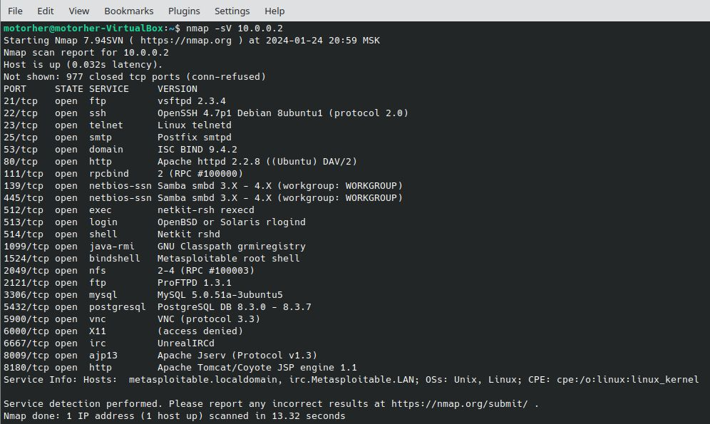
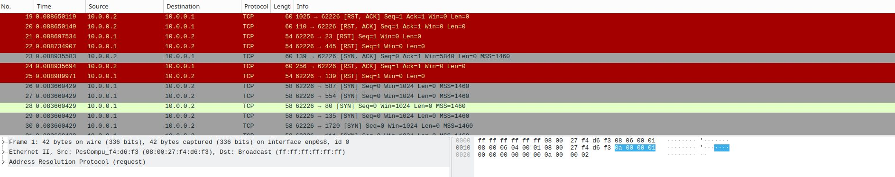
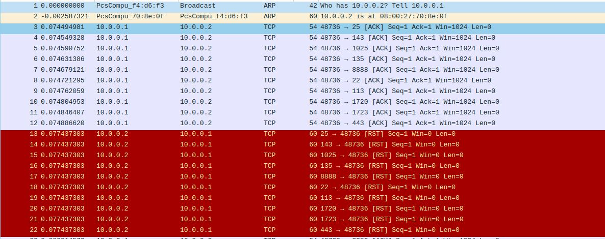
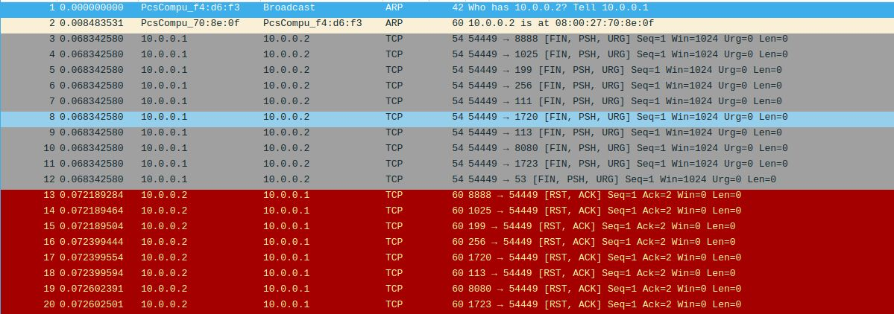
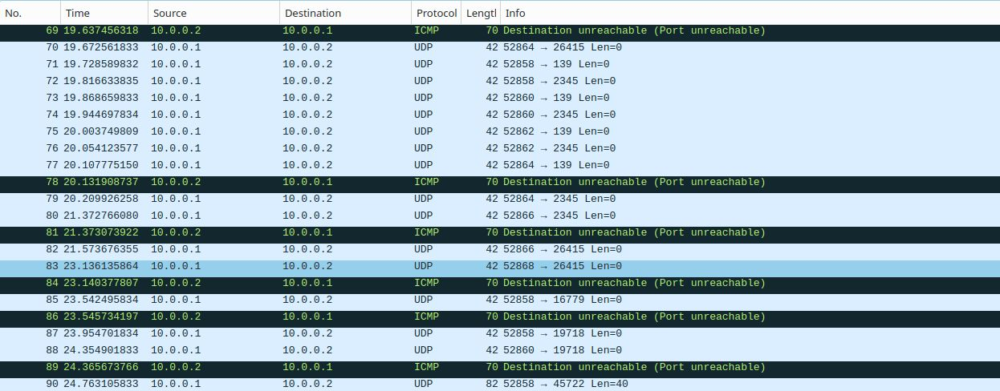

# Домашнее задание к занятию «Уязвимости и атаки на информационные системы» «Шадрин Игорь»

### Задание 1

Скачайте и установите виртуальную машину Metasploitable: https://sourceforge.net/projects/metasploitable/.

Это типовая ОС для экспериментов в области информационной безопасности, с которой следует начать при анализе уязвимостей.

Просканируйте эту виртуальную машину, используя **nmap**.

Попробуйте найти уязвимости, которым подвержена эта виртуальная машина.

Сами уязвимости можно поискать на сайте https://www.exploit-db.com/.

Для этого нужно в поиске ввести название сетевой службы, обнаруженной на атакуемой машине, и выбрать подходящие по версии уязвимости.

Ответьте на следующие вопросы:

- Какие сетевые службы в ней разрешены?
- Какие уязвимости были вами обнаружены? (список со ссылками: достаточно трёх уязвимостей)
  
*Приведите ответ в свободной форме.*  

### Решение 1

Следующие сетевые службы были обнаружены путем сканирования:

Примеры обнаруженых уязвимостей:
1) vsftpd 2.3.4 Backdoor Command Execution https://www.exploit-db.com/exploits/17491
2) OpenSSH < 6.6 SFTP - Command Execution https://www.exploit-db.com/exploits/45001
3) PostgreSQL 8.2/8.3/8.4 - UDF for Command Execution https://www.exploit-db.com/exploits/7855

### Задание 2

Проведите сканирование Metasploitable в режимах SYN, FIN, Xmas, UDP.

Запишите сеансы сканирования в Wireshark.

Ответьте на следующие вопросы:

- Чем отличаются эти режимы сканирования с точки зрения сетевого трафика?
- Как отвечает сервер?

*Приведите ответ в свободной форме.*

### Решение 2

1) При SYN сканировании не происходит TCP соединения. Nmap посылает SYN пакет, говоря о попытке открытия реального соединения и ждет. 
Сервер отвечает либо SYN/ACK, что указывают на то, что порт прослушивается (открыт), либо RST (сброс) на то, что не прослушивается. 

2) FIN сканирование из 6 флагов ТCP, устанавливается только FIN флаг.
Сервер отвечает на такой кадр RST в ответ в случае, если порт закрыт, или не повлечет никакого ответа, если порт открыт

3) Xmas сканирование из 6 флагов ТCP, устанавливаются FIN, PSH и URG флаги.
Сервер отвечает на такой кадр RST в ответ в случае, если порт закрыт, или не повлечет никакого ответа, если порт открыт

4) UDP сканирование работает путем посылки пустого (без данных) UDP заголовка на каждый целевой порт.
Сервер отвечает ICMP ошибкой о недостижимости порта, либо ICMP ошибкой о том, что порт фильтруется. UDP пакет в ответ означает открытый порт. 

