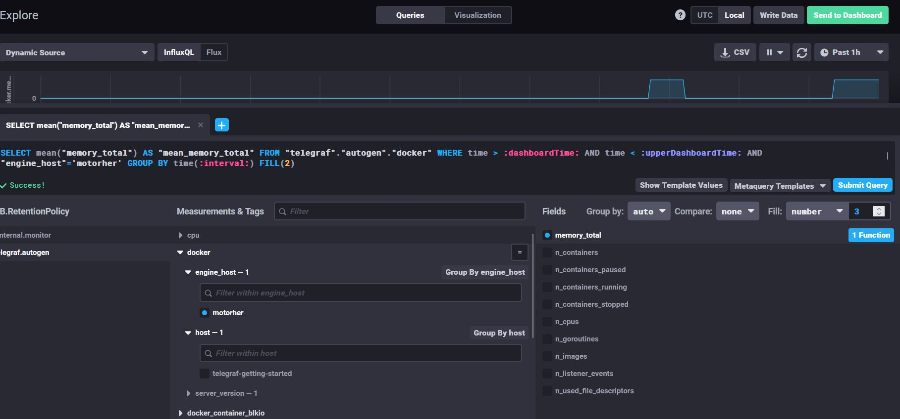
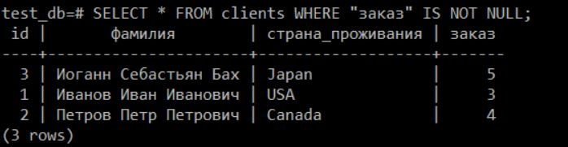
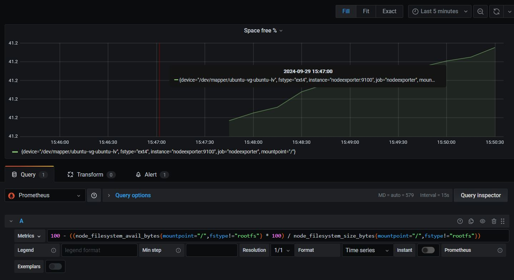
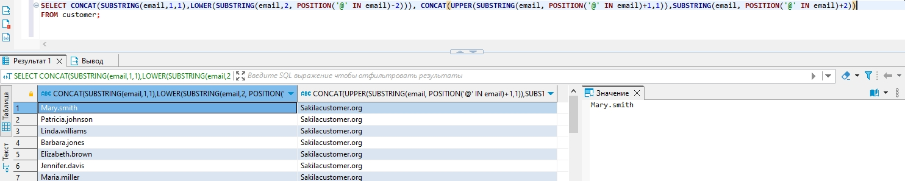

# Домашнее задание к занятию «SQL. Часть 1» «Шадрин Игорь» 

### Задание 1

Получите уникальные названия районов из таблицы с адресами, которые начинаются на “K” и заканчиваются на “a” и не содержат пробелов.

### Решение 1

```sql
SELECT DISTINCT district
FROM address
WHERE district LIKE 'K%a' AND district NOT LIKE '% %';
```


### Задание 2

Получите из таблицы платежей за прокат фильмов информацию по платежам, которые выполнялись в промежуток с 15 июня 2005 года по 18 июня 2005 года **включительно** и стоимость которых превышает 10.00.

### Решение 2

```sql
SELECT DISTINCT customer_id, staff_id, rental_id, amount, payment_date
FROM payment
WHERE payment_date >= '2005-06-15' AND payment_date < '2005-06-19 00:00:00' AND amount > 10
ORDER BY payment_date;

```


### Задание 3

Получите последние пять аренд фильмов.

### Решение 3

```sql
SELECT *
FROM rental
ORDER BY rental_date DESC
LIMIT 5;
```


### Задание 4

Одним запросом получите активных покупателей, имена которых Kelly или Willie. 

Сформируйте вывод в результат таким образом:
- все буквы в фамилии и имени из верхнего регистра переведите в нижний регистр,
- замените буквы 'll' в именах на 'pp'.

### Решение 4

```sql
SELECT LOWER(REPLACE(first_name, 'L','P')), LOWER(last_name)
FROM customer
WHERE first_name = 'kelly' OR first_name = 'willie';
```



### Задание 5*

Выведите Email каждого покупателя, разделив значение Email на две отдельных колонки: в первой колонке должно быть значение, указанное до @, во второй — значение, указанное после @.

### Решение 5

```sql
SELECT SUBSTRING(email,2, POSITION('@' IN email)-1), SUBSTRING(email, POSITION('@' IN email)+1)
FROM customer;

```



### Задание 6*

Доработайте запрос из предыдущего задания, скорректируйте значения в новых колонках: первая буква должна быть заглавной, остальные — строчными.

### Решение 6

```sql
SELECT CONCAT(SUBSTRING(email,1,1),LOWER(SUBSTRING(email,2, POSITION('@' IN email)-2))), CONCAT(UPPER(SUBSTRING(email, POSITION('@' IN email)+1,1)),SUBSTRING(email, POSITION('@' IN email)+2))
FROM customer;
```

