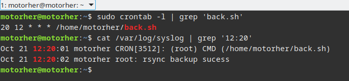
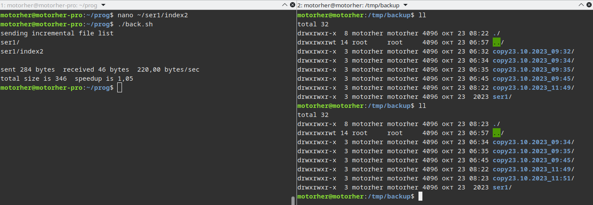
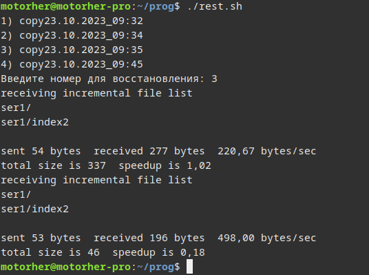

# Домашнее задание к занятию «Резервное копирование» - `Шадрин Игорь`
### Задание 1
- Составьте команду rsync, которая позволяет создавать зеркальную копию домашней директории пользователя в директорию `/tmp/backup`
- Необходимо исключить из синхронизации все директории, начинающиеся с точки (скрытые)
- Необходимо сделать так, чтобы rsync подсчитывал хэш-суммы для всех файлов, даже если их время модификации и размер идентичны в источнике и приемнике.
- На проверку направить скриншот с командой и результатом ее выполнения

### Решение 1
```bash
rsync -av --checksum --ignore-times --exclude='.*/' /home/motorher /tmp/backup
```


### Задание 2
- Написать скрипт и настроить задачу на регулярное резервное копирование домашней директории пользователя с помощью rsync и cron.
- Резервная копия должна быть полностью зеркальной
- Резервная копия должна создаваться раз в день, в системном логе должна появляться запись об успешном или неуспешном выполнении операции
- Резервная копия размещается локально, в директории `/tmp/backup`
- На проверку направить файл crontab и скриншот с результатом работы утилиты.

### Решение 2
Скрипт:
```bash
#!/bin/bash
rsync -av  /home/motorher /tmp/backup
if [[ $? -eq 0 ]]; then
    logger "rsync backup sucess"
else
    logger "backup error code = $?"
fi
```
Crontab и результат выполнения:


---

## Задания со звёздочкой*
Эти задания дополнительные. Их можно не выполнять. На зачёт это не повлияет. Вы можете их выполнить, если хотите глубже разобраться в материале.

---

### Задание 3*
- Настройте ограничение на используемую пропускную способность rsync до 1 Мбит/c
- Проверьте настройку, синхронизируя большой файл между двумя серверами
- На проверку направьте команду и результат ее выполнения в виде скриншота
  
### Решение 3
```bash
rsync -avz -e "ssh -p 2223 -i ./local.rsa" --bwlimit=1000 --progress /home/motorher/Downloads/ubuntu-22.04.3-live-server-amd64.iso  motorher@127.0.0.1:/tmp/backup

```


### Задание 4*
- Напишите скрипт, который будет производить инкрементное резервное копирование домашней директории пользователя с помощью rsync на другой сервер
- Скрипт должен удалять старые резервные копии (сохранять только последние 5 штук)
- Напишите скрипт управления резервными копиями, в нем можно выбрать резервную копию и данные восстановятся к состоянию на момент создания данной резервной копии.
- На проверку направьте скрипт и скриншоты, демонстрирующие его работу в различных сценариях.

### Решение 4
Скрипт для создания резервных копий:
```bash
#!/bin/bash
rsync -avhb -e  "ssh -p 2223 -i ./test" --delete --backup-dir=copy$(date +%d.%m.%Y_%H:%M) /home/motorher/ser1  motorher@127.0.0.1:/tmp/backup/
ssh -p 2223 -i ./test 127.0.0.1 'bash -s' <<\EOF
cd '/tmp/backup'
NUM_C=$(ls -l | grep 'copy' | wc -l)
if [[ "$NUM_C" -gt "5" ]]; then
 while [ "$NUM_C" -gt "5" ]
  do
    rm -rf $(ls -l | grep 'copy' | cut -d ' ' -f 9 | head -n1)
    NUM_C=$(ls -l | grep 'copy' | wc -l)
  done
fi

EOF
```
Результат выполнения:


Скрипт для управления резервными копиями:
```bash
#!/bin/bash
#вывести список доступных каталогов с бекапом
ssh -p 2223 -i ./test 127.0.0.1 'bash -s' <<\EOF
cd '/tmp/backup'
NUM_C=$(ls -l | grep 'copy' | cut -d ' ' -f 9 | wc -l)
for (( i=1; i <= $NUM_C; i++ ))
do
 echo "$i) $(ls -l | grep 'copy' | cut -d ' ' -f 9 | head -n$i | tail -n1  )"
done

EOF
#выдернуть количество каталогов с бекапом
NUM_C=$(ssh -p 2223 -i ./test 127.0.0.1 "cd /tmp/backup ;  ls -l | grep 'copy' | cut -d ' ' -f 9 | wc -l")

read -p 'Введите номер для восстановления: ' NUM_R
#проверка на корректность ввода
for (( j=1; j <= $NUM_C; j++ ))
do
 if [[ $j -eq $NUM_R  ]]; then
  rsync -arv --delete -e "ssh -p 2223 -i ./test" motorher@127.0.0.1:/tmp/backup/ser1 /home/motorher/
  R_NAME=$(ssh -p 2223 -i ./test 127.0.0.1 "cd /tmp/backup ;  ls -l | grep 'copy' | cut -d ' ' -f 9 | head -n$j | tail -n1")
  rsync -arv -e "ssh -p 2223 -i ./test" motorher@127.0.0.1:/tmp/backup/$R_NAME/ser1 /home/motorher/
 fi
done
```

Результат выполнения:
