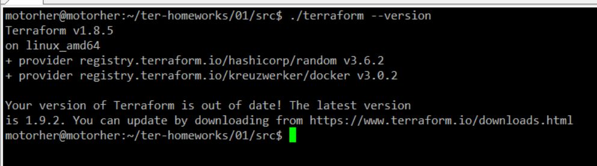
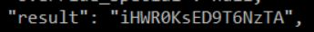

# Домашнее задание к занятию "`Введение в Terraform`" - `Шадрин Игорь`


### Задание 1

1. Перейдите в каталог [**src**](https://github.com/netology-code/ter-homeworks/tree/main/01/src). Скачайте все необходимые зависимости, использованные в проекте. 
2. Изучите файл **.gitignore**. В каком terraform-файле, согласно этому .gitignore, допустимо сохранить личную, секретную информацию?(логины,пароли,ключи,токены итд)
3. Выполните код проекта. Найдите  в state-файле секретное содержимое созданного ресурса **random_password**, пришлите в качестве ответа конкретный ключ и его значение.
4. Раскомментируйте блок кода, примерно расположенный на строчках 29–42 файла **main.tf**.
Выполните команду ```terraform validate```. Объясните, в чём заключаются намеренно допущенные ошибки. Исправьте их.
5. Выполните код. В качестве ответа приложите: исправленный фрагмент кода и вывод команды ```docker ps```.
6. Замените имя docker-контейнера в блоке кода на ```hello_world```. Не перепутайте имя контейнера и имя образа. Мы всё ещё продолжаем использовать name = "nginx:latest". Выполните команду ```terraform apply -auto-approve```.
Объясните своими словами, в чём может быть опасность применения ключа  ```-auto-approve```. Догадайтесь или нагуглите зачем может пригодиться данный ключ? В качестве ответа дополнительно приложите вывод команды ```docker ps```.
8. Уничтожьте созданные ресурсы с помощью **terraform**. Убедитесь, что все ресурсы удалены. Приложите содержимое файла **terraform.tfstate**. 
9. Объясните, почему при этом не был удалён docker-образ **nginx:latest**. Ответ **ОБЯЗАТЕЛЬНО НАЙДИТЕ В ПРЕДОСТАВЛЕННОМ КОДЕ**, а затем **ОБЯЗАТЕЛЬНО ПОДКРЕПИТЕ** строчкой из документации [**terraform провайдера docker**](https://docs.comcloud.xyz/providers/kreuzwerker/docker/latest/docs).  (ищите в классификаторе resource docker_image )

### Решение 1

Версия terraform: 



Судя по приведенному .gitignore файле, секретную информацию можно было бы хранить в папке .terraform и в файлах состояния tfstate

Содержимое **random_password**



Исправленные ошибки:
```bash
23,24c23,24
< /*
< resource "docker_image" {
---
>
> resource "docker_image" "nginx" {
29c29
< resource "docker_container" "1nginx" {
---
> resource "docker_container" "container_1" {
31c31
<   name  = "example_${random_password.random_string_FAKE.resulT}"
---
>   name  = "example_${random_password.random_string.result}"
38c38
< */
---
>

```

Вывод docker ps:


Файл tfstate:


docker-образ **nginx:latest** не был удален, так как переменная keep_locally была установлена в положение True,
обараз docker не удалится при операции уничтожения.