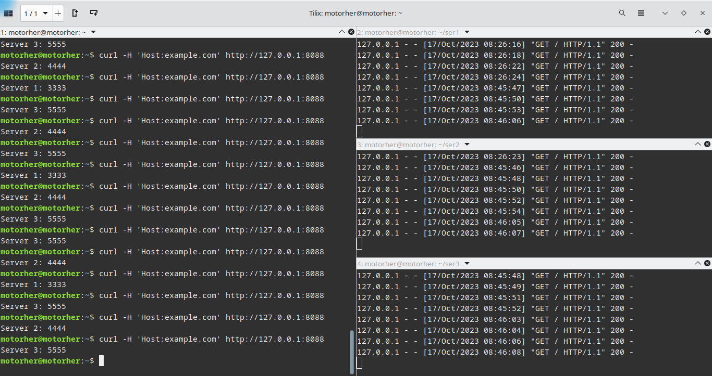
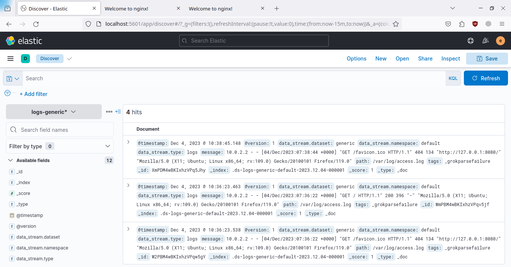
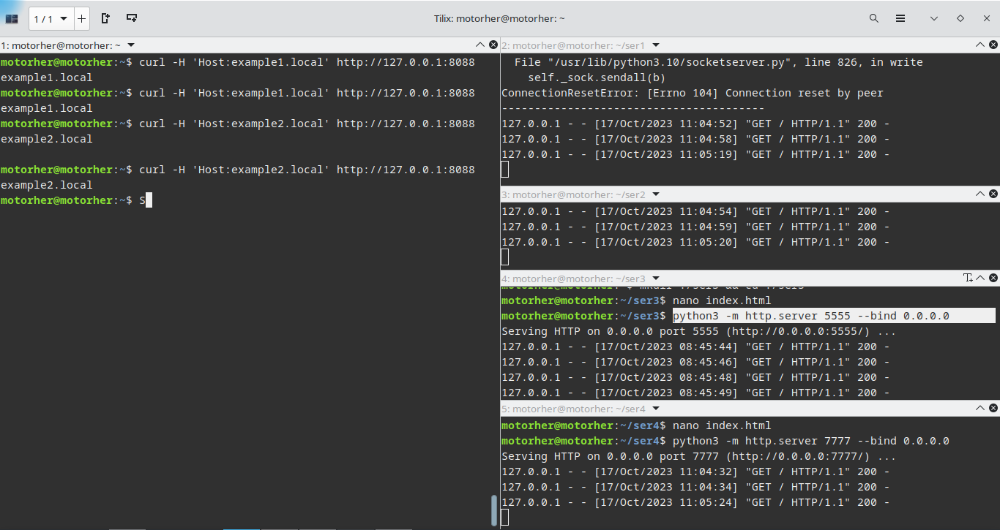
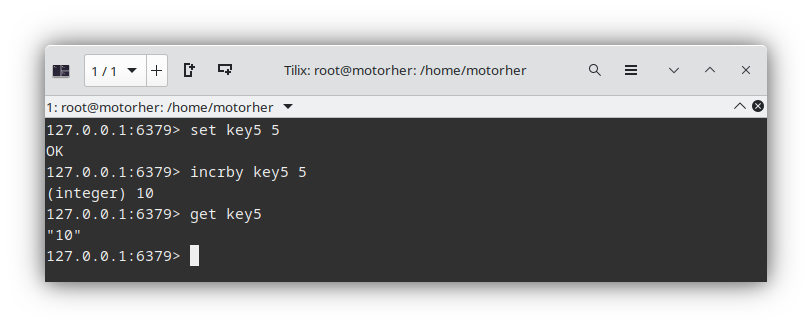

# Домашнее задание к занятию «Кеширование Redis/memcached» «Шадрин Игорь»

### Задание 1. Кеширование 

Приведите примеры проблем, которые может решить кеширование. 

*Приведите ответ в свободной форме.*

### Решение 1. 

Кеширование решает проблему "бутылочного горлышка" - чтение/запись жестких дисков, ускоряя доступ к наиболее часто запрашиваемым данным, помещая их в оперативную память. 
Кэш так же может служить центральным уровнем, к которому могут обращаться различные несвязанные между собой системы в системах распределенных вычислений

---

### Задание 2. Memcached

Установите и запустите memcached.

*Приведите скриншот systemctl status memcached, где будет видно, что memcached запущен.*

### Решение 2.

---

### Задание 3. Удаление по TTL в Memcached

Запишите в memcached несколько ключей с любыми именами и значениями, для которых выставлен TTL 5. 

*Приведите скриншот, на котором видно, что спустя 5 секунд ключи удалились из базы.*

### Решение 3.

---

### Задание 4. Запись данных в Redis

Запишите в Redis несколько ключей с любыми именами и значениями. 

*Через redis-cli достаньте все записанные ключи и значения из базы, приведите скриншот этой операции.*

### Решение 4.

### Задание 5*. Работа с числами 

Запишите в Redis ключ key5 со значением типа "int" равным числу 5. Увеличьте его на 5, чтобы в итоге в значении лежало число 10.  

*Приведите скриншот, где будут проделаны все операции и будет видно, что значение key5 стало равно 10.*

### Решение 5.
