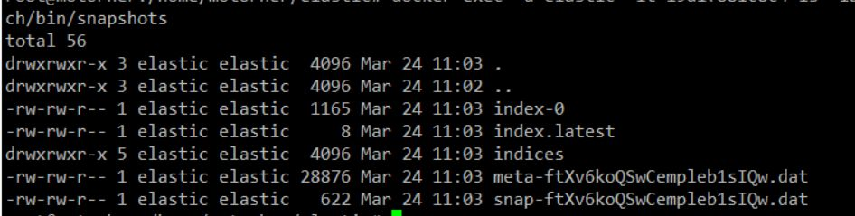
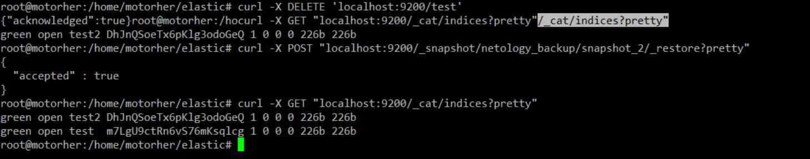

# Домашнее задание к занятию 5. «Elasticsearch» «Шадрин Игорь»

## Задача 1

В этом задании вы потренируетесь в:

- установке Elasticsearch,
- первоначальном конфигурировании Elasticsearch,
- запуске Elasticsearch в Docker.

Используя Docker-образ [centos:7](https://hub.docker.com/_/centos) как базовый и 
[документацию по установке и запуску Elastcisearch](https://www.elastic.co/guide/en/elasticsearch/reference/current/targz.html):

- составьте Dockerfile-манифест для Elasticsearch,
- соберите Docker-образ и сделайте `push` в ваш docker.io-репозиторий,
- запустите контейнер из получившегося образа и выполните запрос пути `/` c хост-машины.

Требования к `elasticsearch.yml`:

- данные `path` должны сохраняться в `/var/lib`,
- имя ноды должно быть `netology_test`.

В ответе приведите:

- текст Dockerfile-манифеста,
- ссылку на образ в репозитории dockerhub,
- ответ `Elasticsearch` на запрос пути `/` в json-виде.

Подсказки:

- возможно, вам понадобится установка пакета perl-Digest-SHA для корректной работы пакета shasum,
- при сетевых проблемах внимательно изучите кластерные и сетевые настройки в elasticsearch.yml,
- при некоторых проблемах вам поможет Docker-директива ulimit,
- Elasticsearch в логах обычно описывает проблему и пути её решения.

Далее мы будем работать с этим экземпляром Elasticsearch.

## Решение 1


```dockerfile
FROM ubuntu:latest
RUN apt update && apt install -y wget gpg ca-certificates && apt install sudo
RUN wget -qO - https://artifacts.elastic.co/GPG-KEY-elasticsearch | sudo gpg --dearmor -o /usr/share/keyrings/elasticsearch-keyring.gpg && \
echo "deb [trusted=yes signed-by=/usr/share/keyrings/elasticsearch-keyring.gpg] https://mirror.yandex.ru/mirrors/elastic/7/ stable main" | \
tee /etc/apt/sources.list.d/elastic-7.x.list
RUN apt update && apt install elasticsearch
RUN echo "cluster.name: hwork" >> etc/elasticsearch/elasticsearch.yml && \
echo "node.name: netology_test" >> etc/elasticsearch/elasticsearch.yml && \
sed -i "s/path\.data/\#path.data/" etc/elasticsearch/elasticsearch.yml && \
echo "path.data: /var/lib/elasticsearch" >> etc/elasticsearch/elasticsearch.yml && \
echo "network.host: 0.0.0.0" >> etc/elasticsearch/elasticsearch.yml && \
echo "discovery.type: single-node" >> etc/elasticsearch/elasticsearch.yml && \
useradd -MU elastic && \
chown -R elastic:elastic etc/elasticsearch && \
chown -R elastic:elastic usr/share/elasticsearch && \
chown -R elastic:elastic etc/default/elasticsearch && \
chown -R elastic:elastic /var/log/elasticsearch && \
chown -R elastic:elastic /var/lib/elasticsearch && \
EXPOSE 9200
EXPOSE 9300
CMD ["sudo", "-u", "elastic", "usr/share/elasticsearch/bin/elasticsearch"]

```


https://hub.docker.com/layers/igorssource/netologytest/elastic/images/sha256-9a67f01b5b94a8d98fcf962773da99d14164c1680fd6f0d00c090512418aa096?tab=layers


```json
{
  "name" : "netology_test",
  "cluster_name" : "hwork",
  "cluster_uuid" : "Ah6vkF9kTvSIT826Lzib2Q",
  "version" : {
    "number" : "7.17.9",
    "build_flavor" : "default",
    "build_type" : "deb",
    "build_hash" : "ef48222227ee6b9e70e502f0f0daa52435ee634d",
    "build_date" : "2023-01-31T05:34:43.305517834Z",
    "build_snapshot" : false,
    "lucene_version" : "8.11.1",
    "minimum_wire_compatibility_version" : "6.8.0",
    "minimum_index_compatibility_version" : "6.0.0-beta1"
  },
  "tagline" : "You Know, for Search"
}

```

## Задача 2

В этом задании вы научитесь:

- создавать и удалять индексы,
- изучать состояние кластера,
- обосновывать причину деградации доступности данных.

Ознакомьтесь с [документацией](https://www.elastic.co/guide/en/elasticsearch/reference/current/indices-create-index.html) 
и добавьте в `Elasticsearch` 3 индекса в соответствии с таблицей:

| Имя | Количество реплик | Количество шард |
|-----|-------------------|-----------------|
| ind-1| 0 | 1 |
| ind-2 | 1 | 2 |
| ind-3 | 2 | 4 |

Получите список индексов и их статусов, используя API, и **приведите в ответе** на задание.

Получите состояние кластера `Elasticsearch`, используя API.

Как вы думаете, почему часть индексов и кластер находятся в состоянии yellow?

Удалите все индексы.

**Важно**

При проектировании кластера Elasticsearch нужно корректно рассчитывать количество реплик и шард,
иначе возможна потеря данных индексов, вплоть до полной, при деградации системы.

## Решение 2

```sh
curl -XPUT 'localhost:9200/ind-1?pretty' -H 'Content-Type: application/json' -d'{"settings" : {"index" : {"number_of_shards" : 1, "number_of_replicas" : 0 }}}'
curl -XPUT 'localhost:9200/ind-2?pretty' -H 'Content-Type: application/json' -d'{"settings" : {"index" : {"number_of_shards" : 2, "number_of_replicas" : 1 }}}'
curl -XPUT 'localhost:9200/ind-3?pretty' -H 'Content-Type: application/json' -d'{"settings" : {"index" : {"number_of_shards" : 4, "number_of_replicas" : 2 }}}'
```

http://localhost:9200/_cat/indices

```json
green  open .geoip_databases L7I4g7mESbikkDxpFMZ1bg 1 0 37 0 34.2mb 34.2mb
green  open ind-1            LpWxByWjRdyplAw6Rl5Rdw 1 0  0 0   226b   226b
yellow open ind-3            My03Gf6gQEOtmOxTLhOUeg 4 2  0 0   904b   904b
yellow open ind-2            03uX7U2xThWwrb1mx_ulKA 2 1  0 0   452b   452b
```

http://localhost:9200/_cluster/health?pretty

```json
cluster_name	"hwork"
status	"yellow"
timed_out	false
number_of_nodes	1
number_of_data_nodes	1
active_primary_shards	10
active_shards	10
relocating_shards	0
initializing_shards	0
unassigned_shards	10
delayed_unassigned_shards	0
number_of_pending_tasks	0
number_of_in_flight_fetch	0
task_max_waiting_in_queue_millis	0
active_shards_percent_as_number	50
```

```sh
curl -X DELETE 'http://127.0.0.1:9200/ind-1'
curl -X DELETE 'http://127.0.0.1:9200/ind-2'
curl -X DELETE 'http://127.0.0.1:9200/ind-3'
```

Предполагаю, что статусы yellow - потому что мы указали количество реплик больше, чем количество нод, на эти реплики назначены шарды, в статусе видны unassigned_shards.


## Задача 3

В этом задании вы научитесь:

- создавать бэкапы данных,
- восстанавливать индексы из бэкапов.

Создайте директорию `{путь до корневой директории с Elasticsearch в образе}/snapshots`.

Используя API, [зарегистрируйте](https://www.elastic.co/guide/en/elasticsearch/reference/current/snapshots-register-repository.html#snapshots-register-repository) 
эту директорию как `snapshot repository` c именем `netology_backup`.

**Приведите в ответе** запрос API и результат вызова API для создания репозитория.

Создайте индекс `test` с 0 реплик и 1 шардом и **приведите в ответе** список индексов.

[Создайте `snapshot`](https://www.elastic.co/guide/en/elasticsearch/reference/current/snapshots-take-snapshot.html) 
состояния кластера `Elasticsearch`.

**Приведите в ответе** список файлов в директории со `snapshot`.

Удалите индекс `test` и создайте индекс `test-2`. **Приведите в ответе** список индексов.

[Восстановите](https://www.elastic.co/guide/en/elasticsearch/reference/current/snapshots-restore-snapshot.html) состояние
кластера `Elasticsearch` из `snapshot`, созданного ранее. 

**Приведите в ответе** запрос к API восстановления и итоговый список индексов.

Подсказки:

- возможно, вам понадобится доработать `elasticsearch.yml` в части директивы `path.repo` и перезапустить `Elasticsearch`.

## Решение 3

```sh
curl -X PUT "localhost:9200/_snapshot/netology_backup?pretty" -H 'Content-Type: application/json' -d'{"type": "fs","settings": {"location": "usr/share/elasticsearch/bin/snapshots"}}'

curl -XPUT 'localhost:9200/_snapshot/netology_backup/snapshot_1?pretty' -H 'Content-Type: application/json' -d'{ "indices": "test", "ignore_unavailable": true, "include_global_state": false}'

curl -X PUT 'localhost:9200/_snapshot/netology_backup/snapshot_1?wait_for_completion=true&pretty'
```




```sh
curl -X DELETE 'localhost:9200/test'
curl -X PUT "localhost:9200/test2?pretty" -H 'Content-Type: application/json' -d'{"settings": {"index": {"number_of_shards": 1,"number_of_replicas": 0}}}'
curl -X POST "localhost:9200/_snapshot/netology_backup/snapshot_2/_restore?pretty"
```




