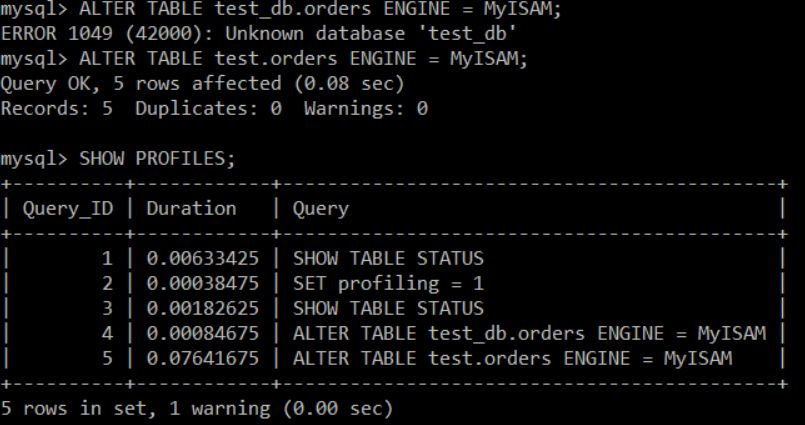
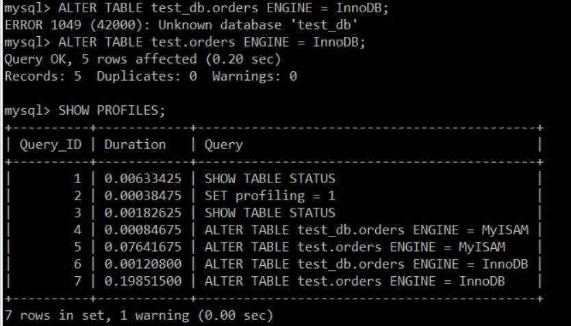

# Домашнее задание к занятию 3. «MySQL» «Шадрин Игорь»


## Задача 1

Используя Docker, поднимите инстанс MySQL (версию 8). Данные БД сохраните в volume.

Изучите [бэкап БД](https://github.com/netology-code/virt-homeworks/tree/virt-11/06-db-03-mysql/test_data) и 
восстановитесь из него.

Перейдите в управляющую консоль `mysql` внутри контейнера.

Используя команду `\h`, получите список управляющих команд.

Найдите команду для выдачи статуса БД и **приведите в ответе** из её вывода версию сервера БД.

Подключитесь к восстановленной БД и получите список таблиц из этой БД.

**Приведите в ответе** количество записей с `price` > 300.

В следующих заданиях мы будем продолжать работу с этим контейнером.

## Решение 1


```sql
SELECT COUNT(*) FROM orders WHERE price > 300;
+----------+
| COUNT(*) |
+----------+
|        1 |
+----------+
1 row in set (0.01 sec)

```

## Задача 2

Создайте пользователя test в БД c паролем test-pass, используя:

- плагин авторизации mysql_native_password
- срок истечения пароля — 180 дней 
- количество попыток авторизации — 3 
- максимальное количество запросов в час — 100
- аттрибуты пользователя:
    - Фамилия "Pretty"
    - Имя "James".

Предоставьте привелегии пользователю `test` на операции SELECT базы `test_db`.
    
Используя таблицу INFORMATION_SCHEMA.USER_ATTRIBUTES, получите данные по пользователю `test` и 
**приведите в ответе к задаче**.

## Решение 2


## Задача 3

Установите профилирование `SET profiling = 1`.
Изучите вывод профилирования команд `SHOW PROFILES;`.

Исследуйте, какой `engine` используется в таблице БД `test_db` и **приведите в ответе**.

Измените `engine` и **приведите время выполнения и запрос на изменения из профайлера в ответе**:
- на `MyISAM`,
- на `InnoDB`.

## Решение 4






## Задача 4 

Изучите файл `my.cnf` в директории /etc/mysql.

Измените его согласно ТЗ (движок InnoDB):

- скорость IO важнее сохранности данных;
- нужна компрессия таблиц для экономии места на диске;
- размер буффера с незакомиченными транзакциями 1 Мб;
- буффер кеширования 30% от ОЗУ;
- размер файла логов операций 100 Мб.

Приведите в ответе изменённый файл `my.cnf`.

```conf
[mysqld]

host-cache-size=0
skip-name-resolve
datadir=/var/lib/mysql
socket=/var/run/mysqld/mysqld.sock
secure-file-priv=/var/lib/mysql-files
user=mysql
pid-file=/var/run/mysqld/mysqld.pid

innodb_flush_log_at_trx_commit = 2
# innodb_flush_log_at_trx_commit = 0 производительно, но не безопасно
innodb_file_per_table = ON
innodb_log_buffer_size = 1M
innodb_buffer_pool_size = 30
innodb_log_file_size = 100M

[client]
socket=/var/run/mysqld/mysqld.sock

!includedir /etc/mysql/conf.d/

```

