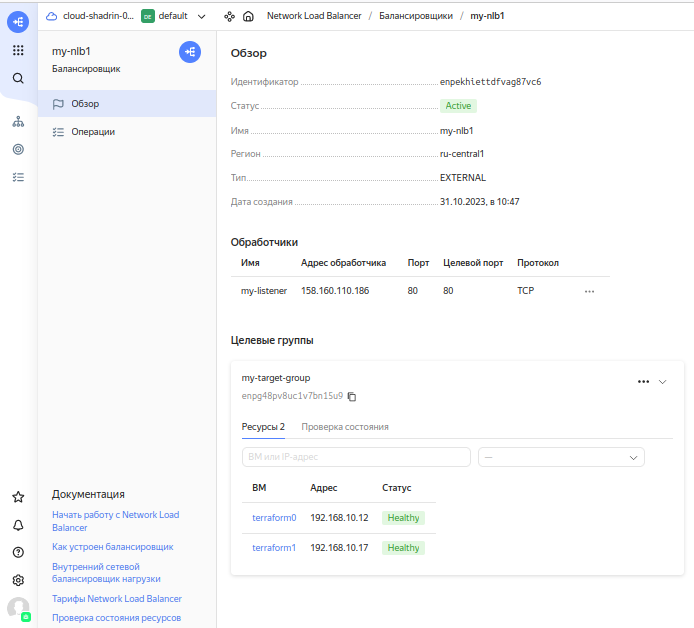
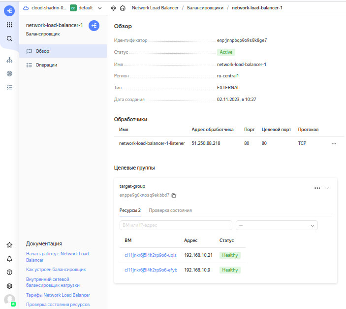
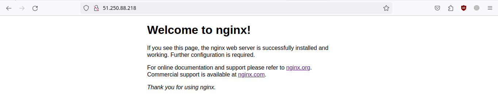

# Домашнее задание к занятию «Отказоустойчивость в облаке» «Шадрин Игорь» 


## Задание 1 

Возьмите за основу [решение к заданию 1 из занятия «Подъём инфраструктуры в Яндекс Облаке»](https://github.com/netology-code/sdvps-homeworks/blob/main/7-03.md#задание-1).

1. Теперь вместо одной виртуальной машины сделайте terraform playbook, который:

- создаст 2 идентичные виртуальные машины. Используйте аргумент [count](https://www.terraform.io/docs/language/meta-arguments/count.html) для создания таких ресурсов;
- создаст [таргет-группу](https://registry.terraform.io/providers/yandex-cloud/yandex/latest/docs/resources/lb_target_group). Поместите в неё созданные на шаге 1 виртуальные машины;
- создаст [сетевой балансировщик нагрузки](https://registry.terraform.io/providers/yandex-cloud/yandex/latest/docs/resources/lb_network_load_balancer), который слушает на порту 80, отправляет трафик на порт 80 виртуальных машин и http healthcheck на порт 80 виртуальных машин.

Рекомендуем изучить [документацию сетевого балансировщика нагрузки](https://cloud.yandex.ru/docs/network-load-balancer/quickstart) для того, чтобы было понятно, что вы сделали.

2. Установите на созданные виртуальные машины пакет Nginx любым удобным способом и запустите Nginx веб-сервер на порту 80.

3. Перейдите в веб-консоль Yandex Cloud и убедитесь, что: 

- созданный балансировщик находится в статусе Active,
- обе виртуальные машины в целевой группе находятся в состоянии healthy.

4. Сделайте запрос на 80 порт на внешний IP-адрес балансировщика и убедитесь, что вы получаете ответ в виде дефолтной страницы Nginx.

*В качестве результата пришлите:*

*1. Terraform Playbook.*

*2. Скриншот статуса балансировщика и целевой группы.*

*3. Скриншот страницы, которая открылась при запросе IP-адреса балансировщика.*

## Решение 1 

# Terraform Playbook
```c
terraform {
  required_providers {
    yandex = {
      source = "yandex-cloud/yandex"
    }
  }
  required_version = ">= 0.13"
}

provider "yandex" {
  token     = var.yandex_cloud_token 
  cloud_id  = "b1g6fo99h0qim9jv8gnk"
  folder_id = "b1g2495p8ldt10kjk28s"
  zone      = "ru-central1-a"
}

resource "yandex_compute_instance" "vm-1" {
 
  count = 2
  
  name = "terraform${count.index}"
  
 
  resources {
    core_fraction = 5
    cores  = 2
    memory = 2
  }

  boot_disk {
    initialize_params {
      image_id = "fd8tgblovu5dklvrp29h"
    }
  }

  network_interface {
    subnet_id = yandex_vpc_subnet.subnet-1.id
    nat       = true
  }
  
  metadata = {
    user-data = "${file("./meta.txt")}"
  }

}
resource "yandex_vpc_network" "network-1" {
  name = "network-1"
}

resource "yandex_vpc_subnet" "subnet-1" {
  name           = "subnet-1"
  zone           = "ru-central1-a"
  network_id     = yandex_vpc_network.network-1.id
  v4_cidr_blocks = ["192.168.10.0/24"]
}

resource "yandex_lb_target_group" "g1" {
  name      = "my-target-group"
  region_id = "ru-central1"

  target {
    subnet_id = "${yandex_vpc_subnet.subnet-1.id}"
    address   = "${yandex_compute_instance.vm-1.0.network_interface.0.ip_address}"
  }

  target {
    subnet_id = "${yandex_vpc_subnet.subnet-1.id}"
    address   = "${yandex_compute_instance.vm-1.1.network_interface.0.ip_address}"
  }
}

resource "yandex_lb_network_load_balancer" "b1" {
  name = "my-nlb1"

  listener {
    name = "my-listener"
    port = 80
    protocol    = "tcp"
    external_address_spec {
      ip_version = "ipv4"
    }
  }

  attached_target_group {
    target_group_id = "${yandex_lb_target_group.g1.id}"

    healthcheck {
      name = "http"
      interval            = 2
      timeout             = 1
      unhealthy_threshold = 2
      healthy_threshold   = 2
      http_options {
        port = 80
        path = "/"
      }
    }
  }
}
```
# Скриншот статуса балансировщика и целевой группы

# Скриншот страницы, которая открылась при запросе IP-адреса балансировщика

---

## Задания со звёздочкой*
Эти задания дополнительные. Выполнять их не обязательно. На зачёт это не повлияет. Вы можете их выполнить, если хотите глубже разобраться в материале.

---

## Задание 2*

1. Теперь вместо создания виртуальных машин создайте [группу виртуальных машин с балансировщиком нагрузки](https://cloud.yandex.ru/docs/compute/operations/instance-groups/create-with-balancer).

2. Nginx нужно будет поставить тоже автоматизированно. Для этого вам нужно будет подложить файл установки Nginx в user-data-ключ [метадаты](https://cloud.yandex.ru/docs/compute/concepts/vm-metadata) виртуальной машины.

- [Пример файла установки Nginx](https://github.com/nar3k/yc-public-tasks/blob/master/terraform/metadata.yaml).
- [Как подставлять файл в метадату виртуальной машины.](https://github.com/nar3k/yc-public-tasks/blob/a6c50a5e1d82f27e6d7f3897972adb872299f14a/terraform/main.tf#L38)

3. Перейдите в веб-консоль Yandex Cloud и убедитесь, что: 

- созданный балансировщик находится в статусе Active,
- обе виртуальные машины в целевой группе находятся в состоянии healthy.

4. Сделайте запрос на 80 порт на внешний IP-адрес балансировщика и убедитесь, что вы получаете ответ в виде дефолтной страницы Nginx.

*В качестве результата пришлите*

*1. Terraform Playbook.*

*2. Скриншот статуса балансировщика и целевой группы.*

*3. Скриншот страницы, которая открылась при запросе IP-адреса балансировщика.*

## Решение 2*

# Terraform Playbook
```c
terraform {
  required_providers {
    yandex = {
      source = "yandex-cloud/yandex"
    }
  }
  required_version = ">= 0.13"
}

provider "yandex" {
  token     = var.yandex_cloud_token 
  cloud_id  = "b1g6fo99h0qim9jv8gnk"
  folder_id = "b1g2495p8ldt10kjk28s"
  zone      = "ru-central1-a"
}

resource "yandex_iam_service_account" "ig-sa" {
  name        = "ig-sa"
  description = "service account to manage IG"
}

resource "yandex_resourcemanager_folder_iam_member" "editor" {
  folder_id = "b1g2495p8ldt10kjk28s"
  role      = "editor"
  member    = "serviceAccount:${yandex_iam_service_account.ig-sa.id}"
}

resource "yandex_compute_instance_group" "ig-1" {
  name                = "fixed-ig-with-balancer"
  folder_id           = "b1g2495p8ldt10kjk28s"
  service_account_id  = "${yandex_iam_service_account.ig-sa.id}"
  deletion_protection = false
  instance_template {
    platform_id = "standard-v3"
    resources {
      core_fraction = 20
      cores  = 2
      memory = 2
    }

    boot_disk {
      mode = "READ_WRITE"
      initialize_params {
        image_id = "fd8tgblovu5dklvrp29h"
      }
    }

    network_interface {
      network_id = "${yandex_vpc_network.network-1.id}"
      subnet_ids = ["${yandex_vpc_subnet.subnet-1.id}"]
      nat = true
    }

    metadata = {
    user-data = "${file("./meta.yml")}"
    }
  }

  scale_policy {
    fixed_scale {
      size = 2
    }
  }

  allocation_policy {
    zones = ["ru-central1-a"]
  }

  deploy_policy {
    max_unavailable = 1
    max_expansion   = 0
  }

  load_balancer {
    target_group_name        = "target-group"
    target_group_description = "load balancer target group"
  }
}

resource "yandex_lb_network_load_balancer" "lb-1" {
  name = "network-load-balancer-1"

  listener {
    name = "network-load-balancer-1-listener"
    port = 80
    external_address_spec {
      ip_version = "ipv4"
    }
  }

  attached_target_group {
    target_group_id = yandex_compute_instance_group.ig-1.load_balancer.0.target_group_id

    healthcheck {
      name = "http"
      http_options {
        port = 80
        path = "/"
      }
    }
  }
}
resource "yandex_vpc_network" "network-1" {
  name = "network1"
}

resource "yandex_vpc_subnet" "subnet-1" {
  name           = "subnet1"
  zone           = "ru-central1-a"
  network_id     = "${yandex_vpc_network.network-1.id}"
  v4_cidr_blocks = ["192.168.10.0/24"]
}

```

# Terraform metadata
```yml
#cloud-config
users:
  - name: user
    groups: sudo
    shell: /bin/bash
    sudo: ['ALL=(ALL) NOPASSWD:ALL']
    ssh-authorized-keys:
      - ******
repo_update: true
repo_upgrade: true
apt:
  preserve_sources_list: true


packages:
  - nginx

runcmd:
  - [ systemctl, nginx-reload ]
  - [ systemctl, enable, nginx.service ]
  - [ systemctl, start, --no-block, nginx.service ]
```
# Скриншот статуса балансировщика и целевой группы.


# Скриншот страницы, которая открылась при запросе IP-адреса балансировщика.
