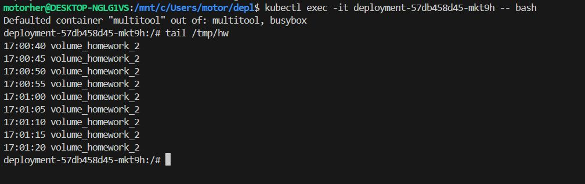
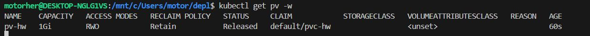

# Домашнее задание к занятию «Хранение в K8s. Часть 2» "Шадрин Игорь"


### Задание 1

**Что нужно сделать**

Создать Deployment приложения, использующего локальный PV, созданный вручную.

1. Создать Deployment приложения, состоящего из контейнеров busybox и multitool.
2. Создать PV и PVC для подключения папки на локальной ноде, которая будет использована в поде.
3. Продемонстрировать, что multitool может читать файл, в который busybox пишет каждые пять секунд в общей директории. 
4. Удалить Deployment и PVC. Продемонстрировать, что после этого произошло с PV. Пояснить, почему.
5. Продемонстрировать, что файл сохранился на локальном диске ноды. Удалить PV.  Продемонстрировать что произошло с файлом после удаления PV. Пояснить, почему.
5. Предоставить манифесты, а также скриншоты или вывод необходимых команд.

### Решение 1

Deployment

```yml
apiVersion: apps/v1
kind: Deployment
metadata:
  name: deployment
  labels:
    app: multitool-busybox
spec:
  replicas: 1
  selector:
    matchLabels:
      app: multitool-busybox
  template:
    metadata:
      labels:
        app: multitool-busybox
    spec:
      containers:
      - name: multitool
        image: wbitt/network-multitool:latest
        volumeMounts:
        - name: homework
          mountPath: /tmp

      - name: busybox
        image: busybox:1.28
        command: [ 'sh', '-c', 'while true; do echo  $(date +"%H:%M:%S") volume_homework_2 >> /tmp/hw; sleep 5;done' ]
        volumeMounts:
        - name: homework
          mountPath: /tmp
      volumes:
      - name: homework
        persistentVolumeClaim:
          claimName: pvc-hw
```

PVC

```yml
apiVersion: v1
kind: PersistentVolumeClaim
metadata:
  name: pvc-hw
spec:
  accessModes:
    - ReadWriteOnce
  storageClassName: ""
  resources:
    requests:
      storage: 1Gi
```

PV
```yml
apiVersion: v1
kind: PersistentVolume
metadata:
  name: pv-hw
spec:
  capacity:
    storage: 1Gi
  accessModes:
    - ReadWriteOnce
  persistentVolumeReclaimPolicy: Retain
  storageClassName: ""
  hostPath:
    path: "/mnt/kuber"
```
multitool может читать файл, в который busybox пишет каждые пять секунд в общей директории



После удаления Deployment и PVC, PV поменял STATUS на Released



Файл сохранился на локальном диске ноды


После удаления PV данные сохранились на ноде, так как стояла опция
persistentVolumeReclaimPolicy: Retain
Для очистки данных можно установить опцию
ersistentVolumeReclaimPolicy:Recycle - pv будет очищен.
------

### Задание 2

**Что нужно сделать**

Создать Deployment приложения, которое может хранить файлы на NFS с динамическим созданием PV.

1. Включить и настроить NFS-сервер на MicroK8S.
2. Создать Deployment приложения состоящего из multitool, и подключить к нему PV, созданный автоматически на сервере NFS.
3. Продемонстрировать возможность чтения и записи файла изнутри пода. 
4. Предоставить манифесты, а также скриншоты или вывод необходимых команд.

### Решение 2

Deployment

```yml
apiVersion: apps/v1
kind: Deployment
metadata:
  name: deployment
  labels:
    app: multitool
spec:
  replicas: 1
  selector:
    matchLabels:
      app: multitool
  template:
    metadata:
      labels:
        app: multitool
    spec:
      containers:
      - name: multitool
        image: wbitt/network-multitool:latest
        volumeMounts:
        - name: homework
          mountPath: /tmp
      volumes:
      - name: homework
        persistentVolumeClaim:
          claimName: pvc-hw
```

PVC

```yml
apiVersion: v1
kind: PersistentVolumeClaim
metadata:
  name: pvc-hw
spec:
  accessModes:
    - ReadWriteOnce
  storageClassName: "microk8s-hostpath"
  resources:
    requests:
      storage: 1Gi
```

 NFS-сервер на MicroK8S

 

Чтение и запись файла изнутри пода

