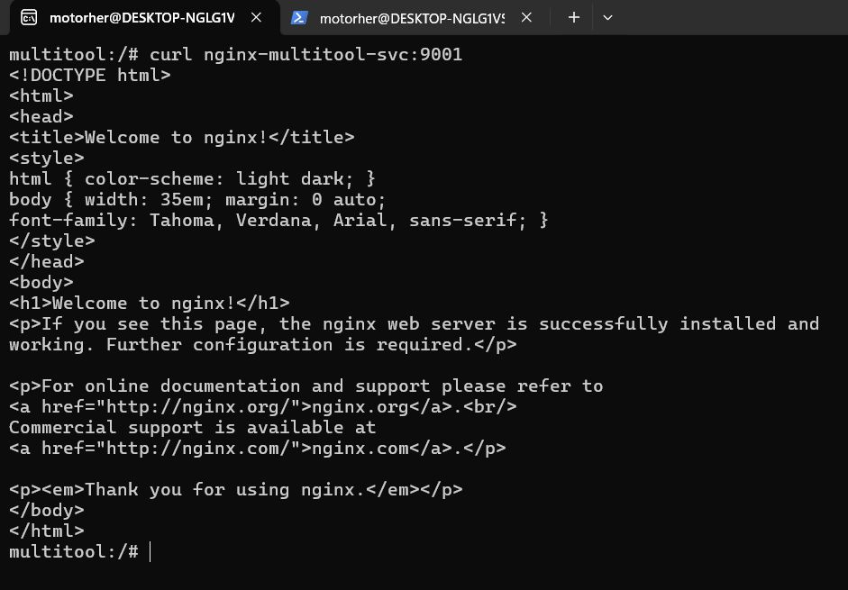
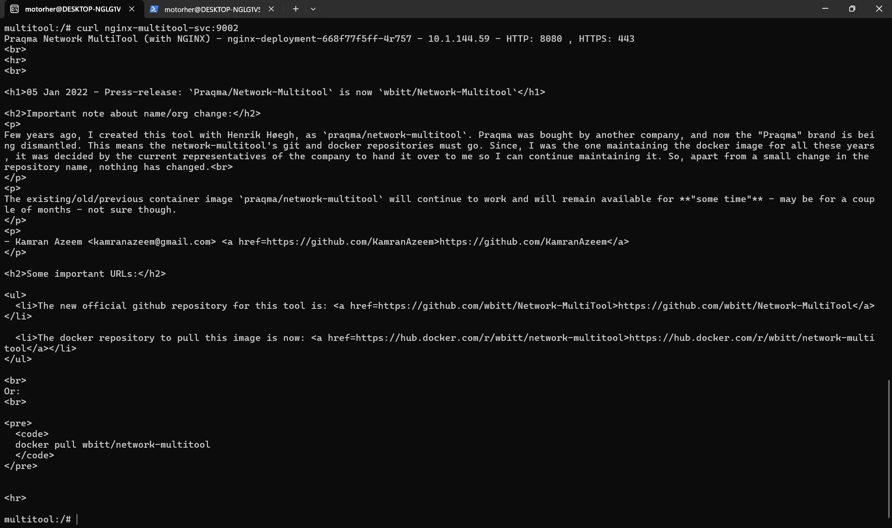
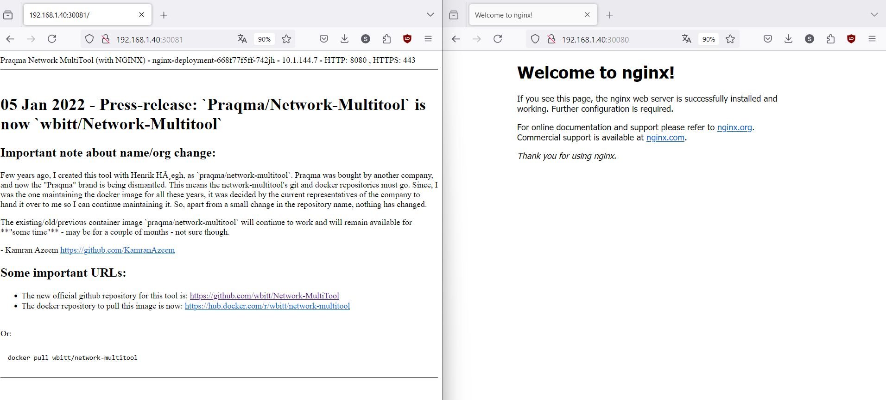

# Домашнее задание к занятию «Сетевое взаимодействие в K8S. Часть 1» "Шадрин Игорь"


### Задание 1. Создать Deployment и обеспечить доступ к контейнерам приложения по разным портам из другого Pod внутри кластера

1. Создать Deployment приложения, состоящего из двух контейнеров (nginx и multitool), с количеством реплик 3 шт.
2. Создать Service, который обеспечит доступ внутри кластера до контейнеров приложения из п.1 по порту 9001 — nginx 80, по 9002 — multitool 8080.
3. Создать отдельный Pod с приложением multitool и убедиться с помощью `curl`, что из пода есть доступ до приложения из п.1 по разным портам в разные контейнеры.
4. Продемонстрировать доступ с помощью `curl` по доменному имени сервиса.
5. Предоставить манифесты Deployment и Service в решении, а также скриншоты или вывод команды п.4.

------

### Решение 1

```yml
apiVersion: apps/v1
kind: Deployment
metadata:
  name: nginx-deployment
  labels:
    app: nginx-multitool
spec:
  replicas: 3
  selector:
    matchLabels:
      app: nginx-multitool
  template:
    metadata:
      labels:
        app: nginx-multitool
    spec:
      containers:
      - name: nginx
        image: nginx:latest
        ports:
        - containerPort: 80
      - name: multitool
        image: praqma/network-multitool
        ports:
        - containerPort: 8080
        env:
        - name: HTTP_PORT
          value: "8080"

---

apiVersion: v1
kind: Service
metadata:
  name: nginx-multitool-svc
spec:
  selector:
    app: nginx-multitool
  ports:
    - name: nginx
      protocol: TCP
      port: 9001
      targetPort: 80
    - name: multitool
      protocol: TCP
      port: 9002
      targetPort: 8080

---
apiVersion: v1
kind: Pod
metadata:
  name: multitool
spec:
  containers:
  - name: multitool
    image: wbitt/network-multitool
```






### Задание 2. Создать Service и обеспечить доступ к приложениям снаружи кластера

1. Создать отдельный Service приложения из Задания 1 с возможностью доступа снаружи кластера к nginx, используя тип NodePort.
2. Продемонстрировать доступ с помощью браузера или `curl` с локального компьютера.
3. Предоставить манифест и Service в решении, а также скриншоты или вывод команды п.2.

### Решение 2

```yml
apiVersion: v1
kind: Service
metadata:
  name: nginx-multitool-nodeport
  labels:
    app: nport
spec:
  ports:
  - name: nginx
    port: 80
    nodePort: 30080
    protocol: TCP
  - name: multitool
    port: 8080
    nodePort: 30081
    protocol: TCP
  selector:
    app: nginx-multitool
  type: NodePort
```

