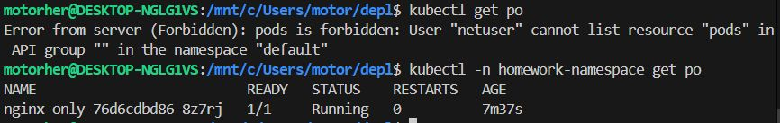
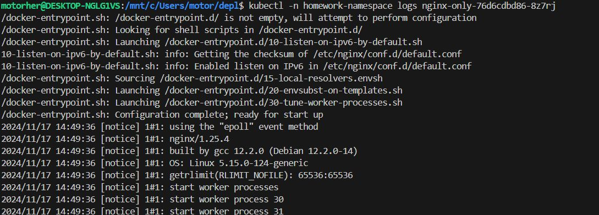
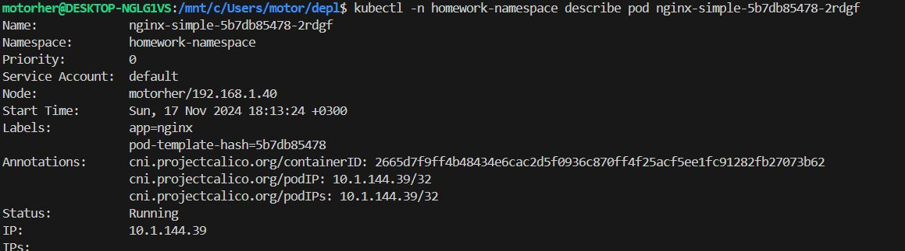

# Домашнее задание к занятию «Управление доступом»

### Задание 1. Создайте конфигурацию для подключения пользователя

1. Создайте и подпишите SSL-сертификат для подключения к кластеру.
2. Настройте конфигурационный файл kubectl для подключения.
3. Создайте роли и все необходимые настройки для пользователя.
4. Предусмотрите права пользователя. Пользователь может просматривать логи подов и их конфигурацию (`kubectl logs pod <pod_id>`, `kubectl describe pod <pod_id>`).
5. Предоставьте манифесты и скриншоты и/или вывод необходимых команд.

------

### Решение 1

Включение rbac в microk8s 

```shell
microk8s enable rbac
```

Генерируем ключ

```shell
openssl genrsa -out netuser.key 2048
```
Генерируем запрос на сертификат

```shell
openssl req -new -key netuser.key -out netuser.csr -subj "/CN=netuser/O=control"
```
Подписываем сертификат корневым сертификатом microk8s

```shell
openssl x509 -req -in netuser.csr -CA /var/snap/microk8s/current/certs/ca.crt -CAkey /var/snap/microk8s/current/certs/ca.key -CAcreateserial -out netuser.crt -days 300
```

Добавление нового пользователя

```shell
kubectl config set-credentials netuser --client-certificate=netuser.crt --client-key=netuser.key
```

Создание нового контекста

```shell
kubectl config set-context netuser-context --cluster=microk8s-cluster --user=netuser
```

Создание нового namespace

```shell
kubectl create namespace homework-namespace
```
Переключение в контекст

```shell
kubectl config use-context netuser-context 
```

<details>

<summary> <h5>Role, RoleBinding, Deployment</h5></summary>

```yaml

kind: Role
apiVersion: rbac.authorization.k8s.io/v1
metadata:
  namespace: homework-namespace
  name: podinfo-viewer
rules:
- apiGroups: [""]
  resources: ["pods","pods/log"]
  verbs: ["get", "watch", "list"]
- apiGroups: ["extensions", "apps"]
  resources: ["deployments"]
  verbs: ["get", "list", "watch"]

---

kind: RoleBinding
apiVersion: rbac.authorization.k8s.io/v1
metadata:
  name: read-pods
  namespace: homework-namespace
subjects:
- kind: User
  name: netuser
  apiGroup: rbac.authorization.k8s.io
roleRef:
  kind: Role
  name: podinfo-viewer
  apiGroup: rbac.authorization.k8s.io

---

apiVersion: apps/v1
kind: Deployment
metadata:
  labels:
    app: nginx
  name: nginx-simple
  namespace: homework-namespace
spec:
  selector:
    matchLabels:
      app: nginx
  replicas: 1
  template:
    metadata:
      labels:
        app: nginx
    spec:
      containers:
        - name: nginx
          image: nginx:latest

```
</details>


Результаты выполнения: 

Созданный пользователь не имеет доступа в дефолтный неймспейс, но имеет доступ в homework-namespace.



Вывод команд (`kubectl logs pod <pod_id>`, `kubectl describe pod <pod_id>`).



