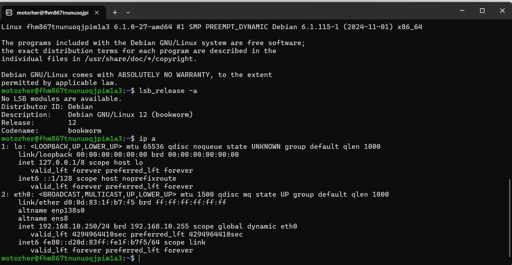
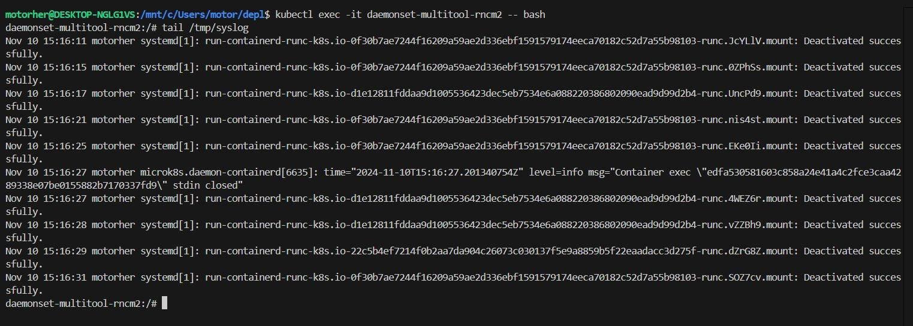
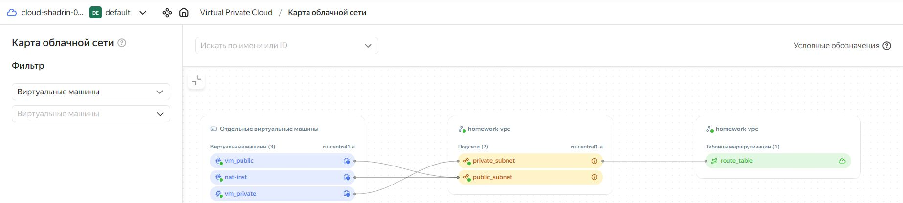

# Домашнее задание к занятию «Организация сети» "Шадрин Игорь"

### Задание 1. Yandex Cloud 

**Что нужно сделать**

1. Создать пустую VPC. Выбрать зону.
2. Публичная подсеть.

 - Создать в VPC subnet с названием public, сетью 192.168.10.0/24.
 - Создать в этой подсети NAT-инстанс, присвоив ему адрес 192.168.10.254. В качестве image_id использовать fd80mrhj8fl2oe87o4e1.
 - Создать в этой публичной подсети виртуалку с публичным IP, подключиться к ней и убедиться, что есть доступ к интернету.
3. Приватная подсеть.
 - Создать в VPC subnet с названием private, сетью 192.168.20.0/24.
 - Создать route table. Добавить статический маршрут, направляющий весь исходящий трафик private сети в NAT-инстанс.
 - Создать в этой приватной подсети виртуалку с внутренним IP, подключиться к ней через виртуалку, созданную ранее, и убедиться, что есть доступ к интернету.


 ### Решение 1.

 
[Код Терраформ](ter)

Подключение к ВМ в публичной сети:



Конфиг для подключения к машине через джамп хост

```shell
Host jumphost
   IdentityFile ~/.ssh/id_rsa
   User motorher
   Hostname 84.201.134.236
Host 192.168.20.250
   IdentityFile ~/.ssh/id_rsa
   User motorher
   ProxyCommand ssh -W %h:%p motorher@jumphost -p 22
```

Подключение к ВМ в закрытой сети:



Карта сети:


