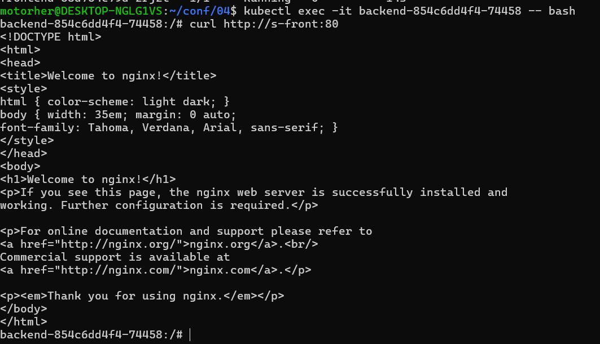
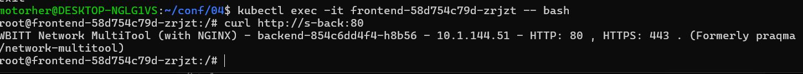
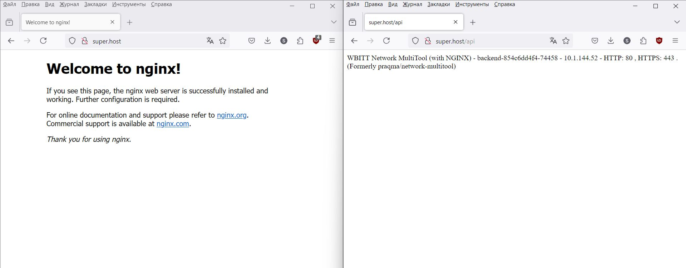

# Домашнее задание к занятию «Сетевое взаимодействие в K8S. Часть 2» "Шадрин Игорь"


### Задание 1. Создать Deployment приложений backend и frontend

1. Создать Deployment приложения _frontend_ из образа nginx с количеством реплик 3 шт.
2. Создать Deployment приложения _backend_ из образа multitool. 
3. Добавить Service, которые обеспечат доступ к обоим приложениям внутри кластера. 
4. Продемонстрировать, что приложения видят друг друга с помощью Service.
5. Предоставить манифесты Deployment и Service в решении, а также скриншоты или вывод команды п.4.

### Решение 1
```yml
apiVersion: apps/v1
kind: Deployment
metadata:
  name: frontend
  labels:
    app: frontend-nginx
spec:
  replicas: 3
  selector:
    matchLabels:
      app: frontend-nginx
  template:
    metadata:
      labels:
        app: frontend-nginx
    spec:
      containers:
      - name: nginx
        image: nginx:latest
        ports:
        - containerPort: 80

---
apiVersion: apps/v1
kind: Deployment
metadata:
  name: backend
  labels:
    app: backend-multitool
spec:
  replicas: 3
  selector:
    matchLabels:
      app: backend-multitool
  template:
    metadata:
      labels:
        app: backend-multitool
    spec:
      containers:
      - name: multitool
        image: wbitt/network-multitool
        ports:
        - containerPort: 80

---
apiVersion: v1
kind: Service
metadata:
  name: s-front
spec:
  ports:
    - name: nginx
      protocol: TCP
      port: 80
      targetPort: 80
  selector:
    app: frontend-nginx
---

apiVersion: v1
kind: Service
metadata:
  name: s-back
spec:
  ports:
    - name: multitool
      protocol: TCP
      port: 80
      targetPort: 80
  selector:
    app: backend-multitool
```




### Задание 2. Создать Ingress и обеспечить доступ к приложениям снаружи кластера

1. Включить Ingress-controller в MicroK8S.
2. Создать Ingress, обеспечивающий доступ снаружи по IP-адресу кластера MicroK8S так, чтобы при запросе только по адресу открывался _frontend_ а при добавлении /api - _backend_.
3. Продемонстрировать доступ с помощью браузера или `curl` с локального компьютера.
4. Предоставить манифесты и скриншоты или вывод команды п.2.

### Решение 2
```yml
apiVersion: networking.k8s.io/v1
kind: Ingress
metadata:
  name: http-ingress
  annotations:
    nginx.ingress.kubernetes.io/rewrite-target: /
spec:
  ingressClassName: "nginx"
  rules:
  - host: super.host
    http:
      paths:
      - path: /
        pathType: Prefix
        backend:
          service:
            name: s-front
            port:
              number: 80
      - path: /api
        pathType: Exact
        backend:
          service:
            name: s-back
            port:
              number: 80
```

