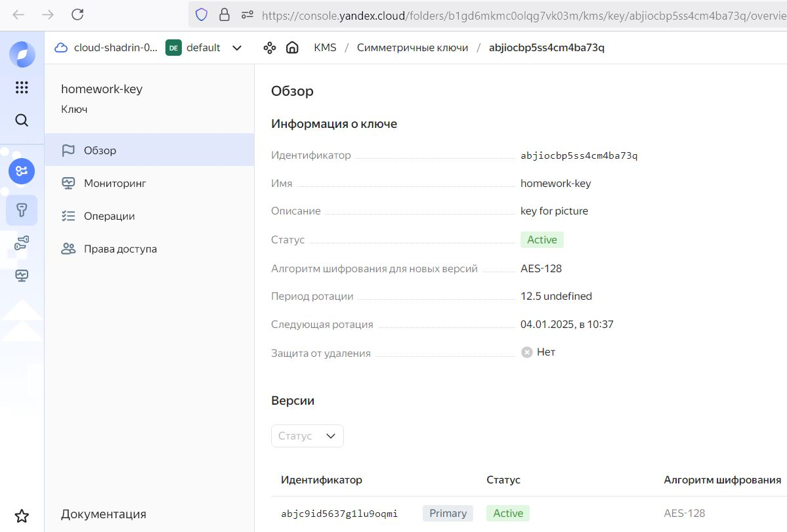
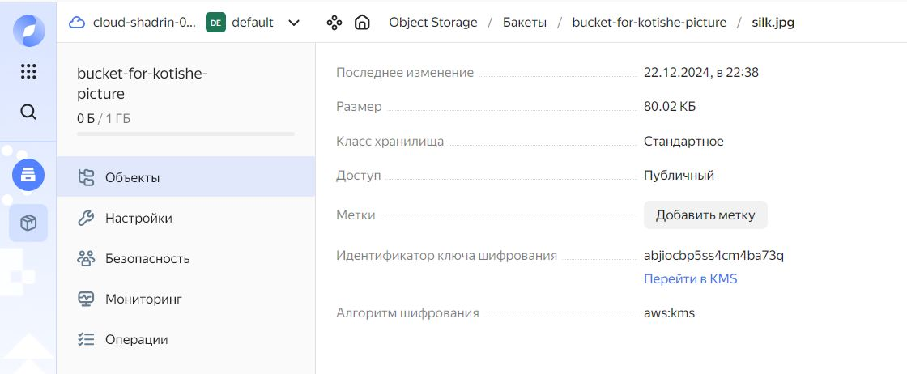
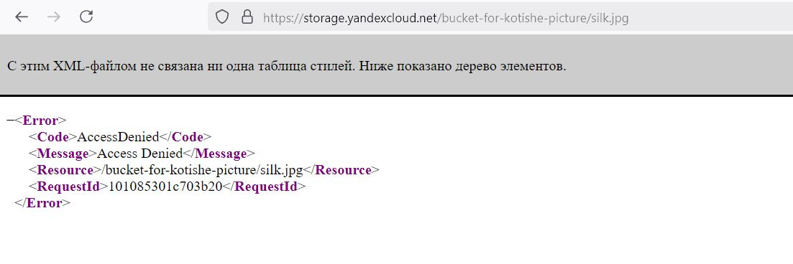

# Домашнее задание к занятию «Безопасность в облачных провайдерах»  "Шадрин Игорь"

Используя конфигурации, выполненные в рамках предыдущих домашних заданий, нужно добавить возможность шифрования бакета.

---
## Задание 1. Yandex Cloud   

1. С помощью ключа в KMS необходимо зашифровать содержимое бакета:

## Решение 1.

[Код терраформ](ter)

Содержимое бакета зашифровано:

Менеджер ключей:

Попытка получить доступ без ключа:

