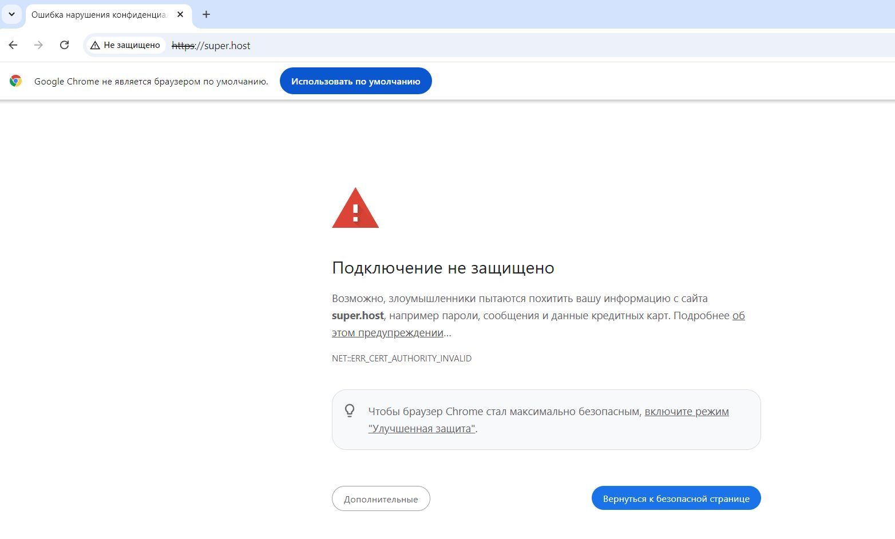

# Домашнее задание к занятию «Конфигурация приложений» "Шадрин Игорь"


### Задание 1. Создать Deployment приложения и решить возникшую проблему с помощью ConfigMap. Добавить веб-страницу

1. Создать Deployment приложения, состоящего из контейнеров nginx и multitool.
2. Решить возникшую проблему с помощью ConfigMap.
3. Продемонстрировать, что pod стартовал и оба конейнера работают.
4. Сделать простую веб-страницу и подключить её к Nginx с помощью ConfigMap. Подключить Service и показать вывод curl или в браузере.
5. Предоставить манифесты, а также скриншоты или вывод необходимых команд.

### Решение 1

<details>

<summary> <h5>Deployment, ConfigMap, Service</h5></summary>

```yml
apiVersion: apps/v1
kind: Deployment
metadata:
  name: nginx-deployment
  labels:
    app: nginx-multitool
spec:
  replicas: 1
  selector:
    matchLabels:
      app: nginx-multitool
  template:
    metadata:
      labels:
        app: nginx-multitool
    spec:
      containers:
      - name: nginx
        image: nginx:latest
        volumeMounts:
        - name: simple-index
          mountPath: /usr/share/nginx/html/
        ports:
        - containerPort: 80
      - name: multitool
        image: wbitt/network-multitool
        ports:
        - containerPort: 8080
        env:
          - name: HTTP_PORT
            valueFrom:
              configMapKeyRef:
                name: problem-resolver
                key: HTTP_PORT
      volumes:
      - name: simple-index
        configMap:
          name: problem-resolver

---

apiVersion: v1
kind: ConfigMap
metadata:
  name: problem-resolver
data:
  HTTP_PORT: '8080'
  index.html: |
    <html>
    <h1>Simple page</h1>
    </html>

---

apiVersion: v1
kind: Service
metadata:
  name: nginx-multitool-nodeport
  labels:
    app: nport
spec:
  ports:
  - name: nginx
    port: 80
    nodePort: 30080
    protocol: TCP
  - name: multitool
    port: 8080
    nodePort: 30081
    protocol: TCP
  selector:
    app: nginx-multitool
  type: NodePort

```

</details>


Запуск пода


Страница в браузере


### Задание 2. Создать приложение с вашей веб-страницей, доступной по HTTPS 

1. Создать Deployment приложения, состоящего из Nginx.
2. Создать собственную веб-страницу и подключить её как ConfigMap к приложению.
3. Выпустить самоподписной сертификат SSL. Создать Secret для использования сертификата.
4. Создать Ingress и необходимый Service, подключить к нему SSL в вид. Продемонстировать доступ к приложению по HTTPS. 
4. Предоставить манифесты, а также скриншоты или вывод необходимых команд.

### Решение 2


<details>

<summary> <h5>Deployment, ConfigMap, Service, Ingress, Secret</h5></summary>

```yml
apiVersion: apps/v1
kind: Deployment
metadata:
  name: nginx-deployment
  labels:
    app: nginx-cert
spec:
  replicas: 1
  selector:
    matchLabels:
      app: nginx-cert
  template:
    metadata:
      labels:
        app: nginx-cert
    spec:
      containers:
      - name: nginx
        image: nginx:latest
        volumeMounts:
        - name: simple-index
          mountPath: /usr/share/nginx/html/
        ports:
        - containerPort: 80
      volumes:
      - name: simple-index
        configMap:
          name: index-page

---

apiVersion: v1
kind: ConfigMap
metadata:
  name: index-page
data:
  index.html: |
    <html>
    <h1>Simple page part 2</h1>
    </html>


---

apiVersion: v1
kind: Service
metadata:
  name: s-front
spec:
  ports:
    - name: nginx
      protocol: TCP
      port: 80
      targetPort: 80
  selector:
    app: nginx-cert


---


apiVersion: networking.k8s.io/v1
kind: Ingress
metadata:
  name: http-ingress
  annotations:
    nginx.ingress.kubernetes.io/rewrite-target: /
spec:
  ingressClassName: "nginx"
  tls:
  - hosts:
    - super.host
    secretName: nginx-secret
  rules:
  - host: super.host
    http:
      paths:
      - path: /
        pathType: Prefix
        backend:
          service:
            name: s-front
            port:
              number: 80

---
apiVersion: v1
type: kubernetes.io/tls
kind: Secret
metadata:
  name: hwcert
  creationTimestamp: "2024-11-14T17:51:10Z"
  name: ingress-cert
  namespace: default
  resourceVersion: "173847"
  uid: cf6e114c-6305-4cfa-869b-0a4fbabe6cff
data:
  tls.crt: |
    LS0tLS1CRUdJTiBDRVJUSUZJQ0FURS0tLS0tCk1JSURZVENDQWttZ0F3SUJBZ0lVSjd2dUVWV0d1
    ZjJFdGZCTFBGRmxZbmtFRFJjd0RRWUpLb1pJaHZjTkFRRUwKQlFBd1FERUxNQWtHQTFVRUJoTUNV
    bFV4RGpBTUJnTlZCQWdNQldoM2IzSnJNU0V3SHdZRFZRUUtEQmhKYm5SbApjbTVsZENCWGFXUm5h
    WFJ6SUZCMGVTQk1kR1F3SGhjTk1qUXhNVEUwTVRjek9EVTRXaGNOTWpVd09URXdNVGN6Ck9EVTRX
    akJBTVFzd0NRWURWUVFHRXdKU1ZURU9NQXdHQTFVRUNBd0ZhSGR2Y21zeElUQWZCZ05WQkFvTUdF
    bHUKZEdWeWJtVjBJRmRwWkdkcGRITWdVSFI1SUV4MFpEQ0NBU0l3RFFZSktvWklodmNOQVFFQkJR
    QURnZ0VQQURDQwpBUW9DZ2dFQkFPbXc4UXVYdUgySzhlMStVR1JhaGRRQ3JYd2o4aTZBM2Q5b25X
    YS9vY1JtOW5ST3ZWTGQyMWZUCmJIbEZCbHQ1Q09RQi9tSkRDN3RheVgwZVJ2TGs5M0JhSFBabS9n
    dnBwbHJoU0xocU84Z3Q3dGdoSDdtMFZCeDkKY1R0SjFlaGYyaFlWYllXQjZrSVBUZHA1cjI4YTla
    L2pWUFV1Nng2ZDF5elRacFFxNUN4bE1Uai9Eck14U0ViYgp4dGtmbk9YajVBRXJlU2xRYmtBU0RI
    SFljRWlWZzloVzFaaWxtMXBSRlgrSndMWjNqZm9BUE16aXFpNFlHeVNjCklaeDZDVFErUTdPM0p2
    ZnlaeW1iakhPdks1WmZGYjdzVlgxSnRNdmxacmNONnBsckR3YjNrZ0NsRDBYdFZVeU8KRjlrd3BI
    Y1hoWG14aTE0QW5sYmxQL3dvU00ydnhQa0NBd0VBQWFOVE1GRXdIUVlEVlIwT0JCWUVGR3BWekZ3
    bQoyTjJ5dUJtV3grVVUrZHFJTGhNU01COEdBMVVkSXdRWU1CYUFGR3BWekZ3bTJOMnl1Qm1XeCtV
    VStkcUlMaE1TCk1BOEdBMVVkRXdFQi93UUZNQU1CQWY4d0RRWUpLb1pJaHZjTkFRRUxCUUFEZ2dF
    QkFBRGxBazZqRzhRTHlxQVgKcCtKOG1wWWdoTTNybEtmcXRzazlQVlNkRU90dWJLeW1iZDlSU05k
    TzZtNW5kWDN0SmxkeFpaZXpvSVBnTGlzZwpRL3U5aEsxZXZybkVrQjdySFBic0VObzFsYi85YXF4
    VEhuMmpURjJDbEdISXF1SHRKUzBPVzBLell5Y3BmQStwCmt4SHh6UmZITkRBSmQ1UjhEMUNMUFlE
    M20zZmwyT21oU2dZSTdzdWw4QzdtRXdaTEROcm82VHp6VnJDaWxKVUUKYmZtYTdVL2p0K01YN05t
    b1EvWXVCdGdFZlJZc0V0bUxUbjRMS3pKNjBWM044RldydmQySVh6c25LUUpaaEliMgpTVUVnYjJU
    a3UyWHFYNDRvZGhnZVI4VGE5c2o2WENtK1BHVll4dksrTVlCa1ByVEVkejVUc21Ud09oalBvcWpa
    CmxkWTJEYms9Ci0tLS0tRU5EIENFUlRJRklDQVRFLS0tLS0K
  tls.key: |
    LS0tLS1CRUdJTiBQUklWQVRFIEtFWS0tLS0tCk1JSUV2UUlCQURBTkJna3Foa2lHOXcwQkFRRUZB
    QVNDQktjd2dnU2pBZ0VBQW9JQkFRRHBzUEVMbDdoOWl2SHQKZmxCa1dvWFVBcTE4SS9JdWdOM2Zh
    SjFtdjZIRVp2WjBUcjFTM2R0WDAyeDVSUVpiZVFqa0FmNWlRd3U3V3NsOQpIa2J5NVBkd1doejJa
    djRMNmFaYTRVaTRhanZJTGU3WUlSKzV0RlFjZlhFN1NkWG9YOW9XRlcyRmdlcENEMDNhCmVhOXZH
    dldmNDFUMUx1c2VuZGNzMDJhVUt1UXNaVEU0L3c2ek1VaEcyOGJaSDV6bDQrUUJLM2twVUc1QUVn
    eHgKMkhCSWxZUFlWdFdZcFp0YVVSVi9pY0MyZDQzNkFEek00cW91R0Jza25DR2NlZ2swUGtPenR5
    YjM4bWNwbTR4egpyeXVXWHhXKzdGVjlTYlRMNVdhM0RlcVphdzhHOTVJQXBROUY3VlZNamhmWk1L
    UjNGNFY1c1l0ZUFKNVc1VC84CktFak5yOFQ1QWdNQkFBRUNnZ0VBQWIyay9ubkFqVFl4Wlkzc0Ur
    TGFhSVpzNmlKWm95L2cxendzaERiWHVzbXMKSGwrOGo1VlQ0MzFLWkdBWHJCMUVaUDR5UU9OcElx
    Z1JnTWlnWHl4dzk4S21UdmlWUlEyQTRYeTB2aXEzVDNTUwpsVzczU2l4dkJUQ0lYUW82V1RsUnll
    OG9panBkbXNpSjV0aGZKM3o1Z2RLWVpWWXJ4clJONlFKRWQ3WmQrSHZtClNpZEg2N2VrK0RIK3VT
    Q3dDYlFxaXNVeTk3TnFESXZRYVVmcUYrRzIvR2tnVkhJR2hCdGZtck9pcGN0UmwvY3IKYVZwb3po
    K2E0KzRTVTJpRGZNMXBkMEtNSENIQmRHNU5KVTlyQUsrZC8zY2k2VEEyRTllNUNRWGs3V0tEN3RW
    TgowdEhLNHFNa2QrNkgvZHFDd2JvN3p0blJTNDdQNktwYVlNeFV0NlVHd1FLQmdRRDdjQnpIcjVR
    V2QxRGgzRXVlCmtHbmtIQ2VRbFFwcVVDRFljc3dLc0YycEFCY1g1NmlPWkhieDhLaUM1WElWNXUy
    aVZIcTJuYnJQSFY1SEFmc0wKSzl1TmdqY2F1YzdHOUNtTE1YS2Z4Zzk2SEg2NzR0MWphanludC8v
    ZStIQ2ZSYWtsZDFMZWU0RW0vNUdQdnA1egpBNTFMSjdFRkpYS1lXcGpEMklsVjRodXM0UUtCZ1FE
    dDdtWDlRSVpNOGJDTUNtZ2xkUTBJVGExNnR5MThiME9KCjZuUzJkTXJBUVFYTlJNZVZmZ1FmMGFS
    VS84Q3NkeTNLUC91NnRhZzdpUjVuRDVOV2JlQit6MlBxZ0VDbmhtNEwKNUV1UFcyWUVKYUM0SDdL
    VG9SRi9PbGpQZEpUanVRWnFCa2dNRUFVR3R2aEtGVk4xQzA0d3VIdGJYQnpjcE4zVgpDMkFMVFYx
    REdRS0JnRUVxRUR0c2RNdlJ4b09TellKZDJTUEdiRGFiZWVTTnVjVi9Fd1NlS3RmMjd3VkNBN3hM
    CnEwd08zQTE0bTdXemNOa0dYZnRnSzU4cjlGZ2cya2hONkl2bk9KTFRueFNQQ1FsTEduTHdLT2l6
    NCtDYjdsYXEKbk9lMjF6aVpXTTdlaGZUdzFPaFdSK1dzakxRZGFnRlM2WHdsNEVuK0o1SDJ3T3JZ
    L3Ria1Q5bmhBb0dCQU5VeQpYU2tFZkZMTjdvaE5ldXkxYWF3YkRtdDdYOEswWUN4Z2JaeGdJcDBL
    cG93OEtTcUc5R01la3NXbk5acFVZQzl1CkRiNUxzQ2RJd25sT3Q1TW1lWmFuZHJ4Vmw1bUZGMjZJ
    Ymp4U2hhTUpwRzNYMlVmM2Q1b3RTZzc2UTcrWnQybWgKbjBWUHhYRXkybUJubzVTcFFMTGZXNG1O
    akQ4WmE3ek9xSXo0RWExaEFvR0FQTFA3djgrQk91Q0RtczNqREQ5bQp1dlpVNmphdlZVdzZ2WEo3
    YnB1OXpJbzI3MUhDTlpadmZvN05BRi9tS1pGQWtOM3dxUW43SGFvTVM0NUV5VnZ1CnZSUXVFRVBo
    eE56Zk9DVVdZVEU2RXdPOS9pN2NDTDdodDgzUnJ4a1JrZGFJSitaRUllZVVWa0Y2TVcvdGZEQlIK
    djU5Y1NWT0tzN1d4VmdxcXIzSG80MjA9Ci0tLS0tRU5EIFBSSVZBVEUgS0VZLS0tLS0K


```

</details>

Генерация сертификатов

```shell
penssl req -x509 -days 300 -nodes -newkey rsa:2048 -keyout ./hw.key -out hw.crt
```
Кодирование в base64

```shell
cat ./hw.key | base64
cat ./hw.crt | base64
```

Браузер ругается на самоподписаный сертификат



Вывод результата

