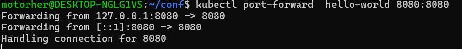
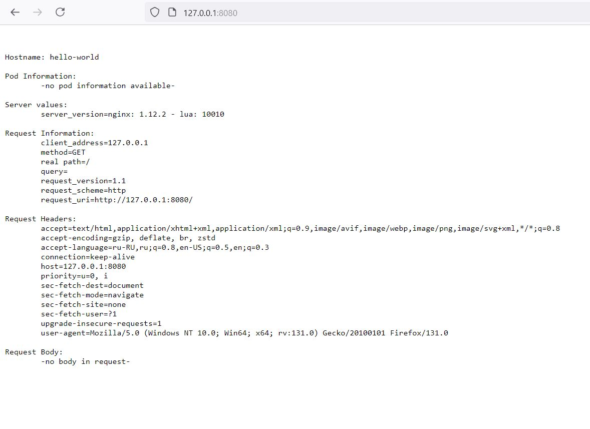
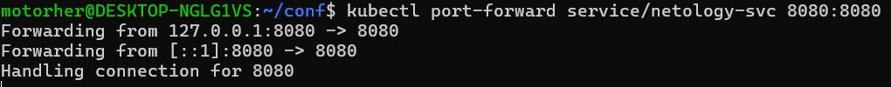
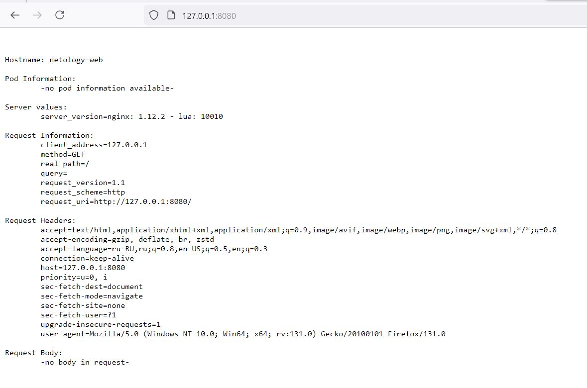

# Домашнее задание к занятию «Базовые объекты K8S» "Шадрин Игорь"


### Задание 1. Создать Pod с именем hello-world

1. Создать манифест (yaml-конфигурацию) Pod.
2. Использовать image - gcr.io/kubernetes-e2e-test-images/echoserver:2.2.
3. Подключиться локально к Pod с помощью `kubectl port-forward` и вывести значение (curl или в браузере).


### Решение 1

```yaml
apiVersion: v1
kind: Pod
metadata:
  labels:
    app: hw1
  name: hello-world
spec:
  containers:
  - name: hello-world
    image: gcr.io/kubernetes-e2e-test-images/echoserver:2.2
    ports:
    - containerPort: 8080
```




------

### Задание 2. Создать Service и подключить его к Pod

1. Создать Pod с именем netology-web.
2. Использовать image — gcr.io/kubernetes-e2e-test-images/echoserver:2.2.
3. Создать Service с именем netology-svc и подключить к netology-web.
4. Подключиться локально к Service с помощью `kubectl port-forward` и вывести значение (curl или в браузере).

### Решение 2

```yaml
apiVersion: v1
kind: Service
metadata:
  name: netology-svc
spec:
  ports:
    - protocol: TCP
      port: 8080
  selector:
    app: netology-web
```
```yaml
apiVersion: v1
kind: Service
metadata:
  name: netology-svc
spec:
  ports:
    - protocol: TCP
      port: 8080
  selector:
    app: netology-web
```



