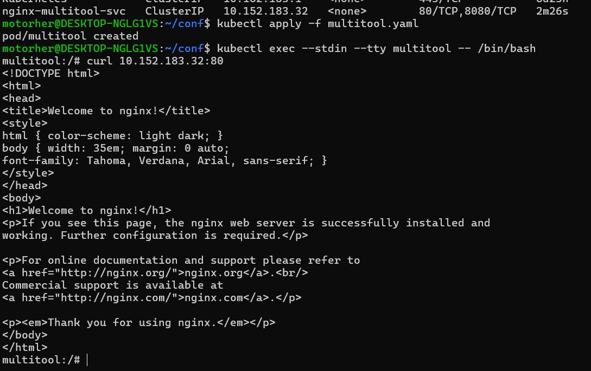
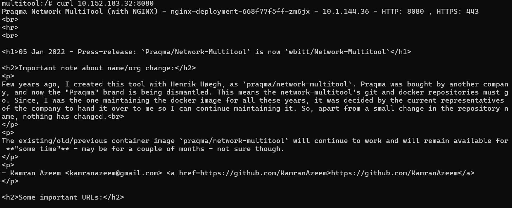
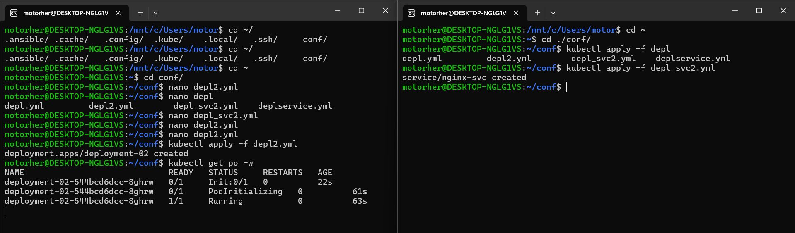

# Домашнее задание к занятию «Запуск приложений в K8S» "Шадрин Игорь"


### Задание 1. Создать Deployment и обеспечить доступ к репликам приложения из другого Pod

1. Создать Deployment приложения, состоящего из двух контейнеров — nginx и multitool. Решить возникшую ошибку.
2. После запуска увеличить количество реплик работающего приложения до 2.
3. Продемонстрировать количество подов до и после масштабирования.
4. Создать Service, который обеспечит доступ до реплик приложений из п.1.
5. Создать отдельный Pod с приложением multitool и убедиться с помощью `curl`, что из пода есть доступ до приложений из п.1.

### Решение 1
Deployment приложения, состоящего из двух контейнеров nginx и multitool. Проблема решена переездом 80го порта контейнера multitool на 8080 через переменную окружения контейнера.
```yml
apiVersion: apps/v1
kind: Deployment
metadata:
  name: nginx-deployment
  labels:
    app: nginx-multitool
spec:
  replicas: 1
  selector:
    matchLabels:
      app: nginx-multitool
  template:
    metadata:
      labels:
        app: nginx-multitool
    spec:
      containers:
      - name: nginx
        image: nginx:latest
        ports:
        - containerPort: 80
      - name: multitool
        image: praqma/network-multitool
        ports:
        - containerPort: 8080
        env:
        - name: HTTP_PORT
          value: "8080"
```
Количество подов после масштабирования 


Service, который обеспечит доступ до реплик приложений из п.1.

```yml
apiVersion: v1
kind: Service
metadata:
  name: nginx-multitool-svc
spec:
  selector:
    app: nginx-multitool
  ports:
    - name: nginx
      protocol: TCP
      port: 80
      targetPort: 80
    - name: multitool
      protocol: TCP
      port: 8080
      targetPort: 8080
```

`curl`до приложений из п.1.





### Задание 2. Создать Deployment и обеспечить старт основного контейнера при выполнении условий

1. Создать Deployment приложения nginx и обеспечить старт контейнера только после того, как будет запущен сервис этого приложения.
2. Убедиться, что nginx не стартует. В качестве Init-контейнера взять busybox.
3. Создать и запустить Service. Убедиться, что Init запустился.
4. Продемонстрировать состояние пода до и после запуска сервиса.

### Решение 2
Deployment приложения nginx иб старт контейнера только после того, как будет запущен сервис этого приложения и сервис
```yml
apiVersion: v1
kind: Deployment
metadata:
  name: deployment-02
  labels:
    app: nginx-02
spec:
  replicas: 1
  selector:
    matchLabels:
      app: nginx-02
  template:
    metadata:
      labels:
        app: nginx-02
    spec:
      initContainers:
      - name: init
        image: busybox:latest
        command: ['sh', '-c', 'until nslookup nginx-svc.default.svc.cluster.local; do sleep 1; done;']
      containers:
      - name: nginx
        image: nginx:latest
        ports:
        - containerPort: 80
```
```yml
apiVersion: v1
kind: Service
metadata:
  name: nginx-svc
spec:
  ports:
    - name: web
      port: 80
      protocol: TCP
      targetPort: 80
  selector:
    app: nginx-02
```

Cостояние пода до и после запуска сервиса.

