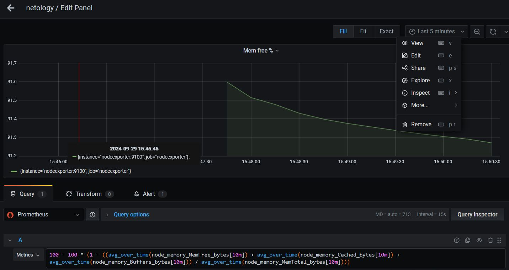

# Домашнее задание к занятию 2. «SQL»

## Задача 1

Используя Docker, поднимите инстанс PostgreSQL (версию 12) c 2 volume, 
в который будут складываться данные БД и бэкапы.

Приведите получившуюся команду или docker-compose-манифест.

## Решение 1

```yml
version: "3.9"
services:
  postgres:
    image: postgres:12.18
    environment:
      POSTGRES_DB: "test_db"
      POSTGRES_USER: "test-admin-user"
      POSTGRES_PASSWORD: "test-admin-passwd"
    ports:
      - "5432:5432"
    volumes:
      - /home/motorher/postgr/data:/var/lib/pgsql/12.18/data
      - /home/motorher/postgr/backup:/tmp

```

## Задача 2

В БД из задачи 1: 

- создайте пользователя test-admin-user и БД test_db;
- в БД test_db создайте таблицу orders и clients (спeцификация таблиц ниже);
- предоставьте привилегии на все операции пользователю test-admin-user на таблицы БД test_db;
- создайте пользователя test-simple-user;
- предоставьте пользователю test-simple-user права на SELECT/INSERT/UPDATE/DELETE этих таблиц БД test_db.

Таблица orders:

- id (serial primary key);
- наименование (string);
- цена (integer).

Таблица clients:

- id (serial primary key);
- фамилия (string);
- страна проживания (string, index);
- заказ (foreign key orders).

Приведите:

- итоговый список БД после выполнения пунктов выше;
- описание таблиц (describe);
- SQL-запрос для выдачи списка пользователей с правами над таблицами test_db;
- список пользователей с правами над таблицами test_db.

## Решение 2


```sql
SELECT grantee, privilege_type 
FROM information_schema.role_table_grants 
WHERE table_name='orders';
```


## Задача 3

Используя SQL-синтаксис, наполните таблицы следующими тестовыми данными:

Таблица orders

|Наименование|цена|
|------------|----|
|Шоколад| 10 |
|Принтер| 3000 |
|Книга| 500 |
|Монитор| 7000|
|Гитара| 4000|

Таблица clients

|ФИО|Страна проживания|
|------------|----|
|Иванов Иван Иванович| USA |
|Петров Петр Петрович| Canada |
|Иоганн Себастьян Бах| Japan |
|Ронни Джеймс Дио| Russia|
|Ritchie Blackmore| Russia|

Используя SQL-синтаксис:
- вычислите количество записей для каждой таблицы.

Приведите в ответе:

    - запросы,
    - результаты их выполнения.

## Решение 3

```sql
INSERT INTO orders ( наименование, цена) 
VALUES
('Шоколад', 10),
('Принтер', 3000),
('Книга', 500),
('Монитор', 7000),
('Гитара', 4000);

INSERT INTO clients ( фамилия, страна_проживания) 
VALUES 
('Иванов Иван Иванович','USA'),
('Петров Петр Петрович','Canada'),
('Иоганн Себастьян Бах','Japan'),
('Ронни Джеймс Дио','Russia'),
('Ritchie Blackmore','Russia');
```


## Задача 4

Часть пользователей из таблицы clients решили оформить заказы из таблицы orders.

Используя foreign keys, свяжите записи из таблиц, согласно таблице:

|ФИО|Заказ|
|------------|----|
|Иванов Иван Иванович| Книга |
|Петров Петр Петрович| Монитор |
|Иоганн Себастьян Бах| Гитара |

Приведите SQL-запросы для выполнения этих операций.

Приведите SQL-запрос для выдачи всех пользователей, которые совершили заказ, а также вывод этого запроса.
 
Подсказка: используйте директиву `UPDATE`.

## Решение 4

```sql
UPDATE clients
SET "заказ" = (SELECT id FROM orders WHERE "наименование" = 'Гитара')
WHERE "фамилия" = 'Иоганн Себастьян Бах';

UPDATE clients
SET "заказ" = (SELECT id FROM orders WHERE "наименование" = 'Книга')
WHERE "фамилия" = 'Иванов Иван Иванович';

UPDATE clients
SET "заказ" = (SELECT id FROM orders WHERE "наименование" = 'Монитор')
WHERE "фамилия" = 'Петров Петр Петрович';

```
```sql
SELECT * FROM clients WHERE "заказ" IS NOT NULL;
```



## Задача 5

Получите полную информацию по выполнению запроса выдачи всех пользователей из задачи 4 
(используя директиву EXPLAIN).

Приведите получившийся результат и объясните, что значат полученные значения.

## Решение 6
```sh
test_db=# EXPLAIN SELECT * FROM clients WHERE "заказ" IS NOT NULL;
                         QUERY PLAN
------------------------------------------------------------
 Seq Scan on clients  (cost=0.00..13.50 rows=348 width=204)
   Filter: ("заказ" IS NOT NULL)
(2 rows)
```
Seq Scan — Последовательное чтение данных таблицы clients
Cost - затраты на операцию. 13.50 — затраты на чтение всех строк в единицах. 
Единица измерения cost – Абстрактная оценка траты времени и ресурсов системы.

rows — примерное количество возвращаемых строк при выполнении операции запроса.

width - это оценка PostgreSQL сколько байт в одной строке (в среднем)

Применяется фильр - не нулевые значения в заказе.

## Задача 6

Создайте бэкап БД test_db и поместите его в volume, предназначенный для бэкапов (см. задачу 1).

Остановите контейнер с PostgreSQL, но не удаляйте volumes.

Поднимите новый пустой контейнер с PostgreSQL.

Восстановите БД test_db в новом контейнере.

Приведите список операций, который вы применяли для бэкапа данных и восстановления. 

## Решение 6

1) Бекап
```sh
sudo docker exec -it 9f26474bceb7 pg_dump -U test-admin-user -d test_db > /tmp/bak1.dump

```

2) Остановить первую базу  
```sh
sudo docker-compose stop

```
2) Вторая машина с пустой базой

```yml
  postgres2:
    image: postgres:12.18
    environment:
      POSTGRES_DB: "test_db"
      POSTGRES_USER: "test-admin-user"
      POSTGRES_PASSWORD: "test-admin-passwd"
    ports:
      - "5433:5432"
    volumes:
     - /home/motorher/postgr/backup:/tmp
```

3) восстановление базы данных
```sh
 sudo docker exec -i 5cbae20b2a1f psql -U test-admin-user -d test_db < /tmp/bak1.dump
```

---


