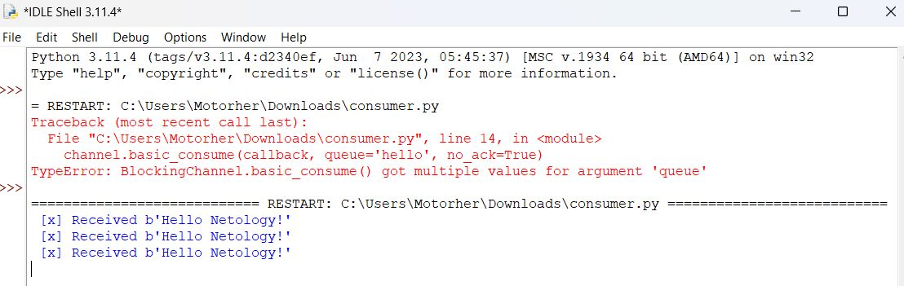

# Домашнее задание к занятию "`Система мониторинга Zabbix`" - `Шадрин Игорь`


### Задание 1

Установите Zabbix Server с веб-интерфейсом.
Процесс выполнения

1.    Выполняя ДЗ, сверяйтесь с процессом отражённым в записи лекции.
2.  Установите PostgreSQL. Для установки достаточна та версия, что есть в системном репозитороии Debian 11.
3.    Пользуясь конфигуратором команд с официального сайта, составьте набор команд для установки последней версии Zabbix с поддержкой PostgreSQL и Apache.
4.    Выполните все необходимые команды для установки Zabbix Server и Zabbix Web Server.

Требования к результаты

    `Прикрепите в файл README.md скриншот авторизации в админке.`
    `Приложите в файл README.md текст использованных команд в GitHub.`

### Решение 1
```bash
sudo -i
wget https://repo.zabbix.com/zabbix/6.0/ubuntu/pool/main/z/zabbix-release/zabbix-release_6.0-4+ubuntu22.04_all.deb
dpkg -i zabbix-release_6.0-4+ubuntu22.04_all.deb
apt update
apt install zabbix-server-pgsql zabbix-frontend-php php8.1-pgsql zabbix-apache-conf zabbix-sql-scripts zabbix-agent
sudo -u postgres createuser --pwprompt zabbix
sudo -u postgres createdb -O zabbix zabbix 
zcat /usr/share/zabbix-sql-scripts/postgresql/server.sql.gz | sudo -u zabbix psql zabbix 
sed -i 's/# DBPassword=/DBPassword=modpass/' /etc/zabbix/zabbix_server.conf
nano /etc/postgresql/14/main/pg_hba.conf
# добавить строки: 
# local all all trust
# host all all 0.0.0.0/0 trust
systemctl restart zabbix-server apache2
systemctl enable zabbix-server apache2 
```


### Задание 2

 Установите Zabbix Agent на два хоста.
Процесс выполнения

1.    Выполняя ДЗ, сверяйтесь с процессом отражённым в записи лекции.
2.    Установите Zabbix Agent на 2 вирт.машины, одной из них может быть ваш Zabbix Server.
3.    Добавьте Zabbix Server в список разрешенных серверов ваших Zabbix Agentов.
4.    Добавьте Zabbix Agentов в раздел Configuration > Hosts вашего Zabbix Servera.
5.    Проверьте, что в разделе Latest Data начали появляться данные с добавленных агентов.

Требования к результаты

   ` Приложите в файл README.md скриншот раздела Configuration > Hosts, где видно, что агенты подключены к серверу
    Приложите в файл README.md скриншот лога zabbix agent, где видно, что он работает с сервером
    Приложите в файл README.md скриншот раздела Monitoring > Latest data для обоих хостов, где видны поступающие от агентов данные.
    Приложите в файл README.md текст использованных команд в GitHub`

### Решение 2



```bash
sudo -i
apt update
wget https://repo.zabbix.com/zabbix/6.0/ubuntu-arm64/pool/main/z/zabbix-release/zabbix-release_6.0-5+ubuntu22.04_all.deb
dpkg -i zabbix-release_6.0-5+ubuntu22.04_all.deb
apt update 
apt install zabbix-agent
systemctl restart zabbix-agent
systemctl enable zabbix-agent 
nano /etc/zabbix/zabbix_agent2.conf
# редактировать строки строки: 
# Server=адрес сервера
systemctl restart zabbix-agent
systemctl enable zabbix-agent
```
### Задание 3

Установите Zabbix Agent на Windows (компьютер) и подключите его к серверу Zabbix.
Требования к результаты

   ` Приложите в файл README.md скриншот раздела Latest Data, где видно свободное место на диске C:`
### Решение 3


