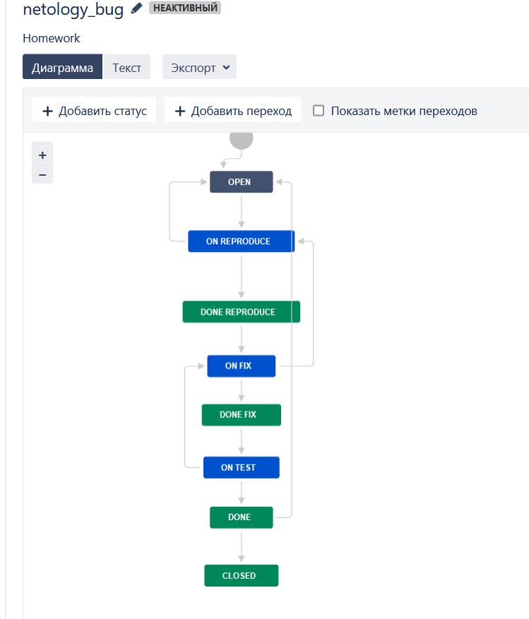

# Домашнее задание к занятию «Кластеризация и балансировка нагрузки» - `Шадрин Игорь`
### Задание 1
- Запустите два simple python сервера на своей виртуальной машине на разных портах
- Установите и настройте HAProxy, воспользуйтесь материалами к лекции по [ссылке](2/)
- Настройте балансировку Round-robin на 4 уровне.
- На проверку направьте конфигурационный файл haproxy, скриншоты, где видно перенаправление запросов на разные серверы при обращении к HAProxy.
### Решение 1
```
frontend example  # секция фронтенд
        mode http
        bind :8088
        default_backend web_servers


backend web_servers    # секция бэкенд
        mode http
        balance roundrobin
        server s1 127.0.0.1:3333
        server s2 127.0.0.1:4444

listen web_tcp # балансировка на 4 уровне

        bind :1325

        server s1 127.0.0.1:3333
        server s2 127.0.0.1:4444
```

### Задание 2
- Запустите три simple python сервера на своей виртуальной машине на разных портах
- Настройте балансировку Weighted Round Robin на 7 уровне, чтобы первый сервер имел вес 2, второй - 3, а третий - 4
- HAproxy должен балансировать только тот http-трафик, который адресован домену example.local
- На проверку направьте конфигурационный файл haproxy, скриншоты, где видно перенаправление запросов на разные серверы при обращении к HAProxy c использованием домена example.local и без него.
### Решение 2
```
frontend example  # секция фронтенд
        mode http
        bind :8088
        acl ACL_example.com hdr(host) -i example.com
        use_backend web_servers if ACL_example.com

backend web_servers    # секция бэкенд
        mode http
        balance roundrobin
        server s1 127.0.0.1:3333 weight 2
        server s2 127.0.0.1:4444 weight 3
        server s3 127.0.0.1:5555 weight 4
```

### Задание 3
- Настройте связку HAProxy + Nginx как было показано на лекции.
- Настройте Nginx так, чтобы файлы .jpg выдавались самим Nginx (предварительно разместите несколько тестовых картинок в директории /var/www/), а остальные запросы переадресовывались на HAProxy, который в свою очередь переадресовывал их на два Simple Python server.
- На проверку направьте конфигурационные файлы nginx, HAProxy, скриншоты с запросами jpg картинок и других файлов на Simple Python Server, демонстрирующие корректную настройку.
### Решение 3
Конфигурация Nginx:
```
server {
   listen       80;


   server_name  example-http.com;


   access_log   /var/log/nginx/example-http.com-acess.log;
   error_log    /var/log/nginx/example-http.com-error.log;

   location ~ \.(jpg)$ {
        root /var/www;
   }
   location / {
        proxy_pass      http://localhost:1325;
   }

}
```
Конфигурация Haproxy:
```
frontend example  # секция фронтенд
        mode http
        bind :8088
        default_backend web_servers


backend web_servers    # секция бэкенд
        mode http
        balance roundrobin
        server s1 127.0.0.1:3333
        server s2 127.0.0.1:4444

listen web_tcp # балансировка на 4 уровне

        bind :1325

        server s1 127.0.0.1:3333
        server s2 127.0.0.1:4444
```


### Задание 4
- Запустите 4 simple python сервера на разных портах.
- Первые два сервера будут выдавать страницу index.html вашего сайта example1.local (в файле index.html напишите example1.local)
- Вторые два сервера будут выдавать страницу index.html вашего сайта example2.local (в файле index.html напишите example2.local)
- Настройте два бэкенда HAProxy
- Настройте фронтенд HAProxy так, чтобы в зависимости от запрашиваемого сайта example1.local или example2.local запросы перенаправлялись на разные бэкенды HAProxy
- На проверку направьте конфигурационный файл HAProxy, скриншоты, демонстрирующие запросы к разным фронтендам и ответам от разных бэкендов.
### Решение 4
```
frontend example  # секция фронтенд
        mode http
        bind :8088
        acl ACL_example1.local hdr(host) -i example1.local
        acl ACL_example2.local hdr(host) -i example2.local
        use_backend web_servers1 if ACL_example1.local
        use_backend web_servers2 if ACL_example2.local


backend web_servers1    # бекенд example1.local
        mode http
        balance roundrobin
        server s1 127.0.0.1:3333
        server s2 127.0.0.1:4444

backend web_servers2    # бэкенд example2.local
        mode http
        balance roundrobin
        server s3 127.0.0.1:7777
        server s5 127.0.0.1:5555
```
