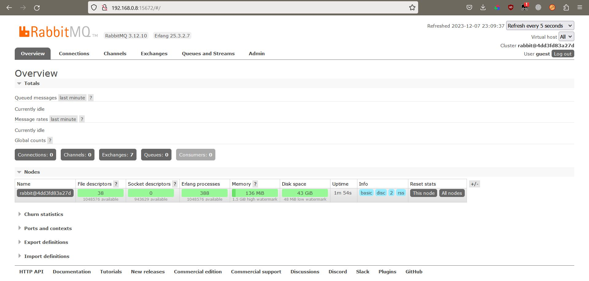

# Домашнее задание к занятию "`GitLab`" - `Шадрин Игорь`


### Задание 1
Что нужно сделать:

1.    Разверните GitLab локально, используя Vagrantfile и инструкцию, описанные в этом репозитории.
2.    Создайте новый проект и пустой репозиторий в нём.
3.    Зарегистрируйте gitlab-runner для этого проекта и запустите его в режиме Docker. Раннер можно регистрировать и запускать на той же виртуальной машине, на которой запущен GitLab.

`В качестве ответа в репозиторий шаблона с решением добавьте скриншоты с настройками раннера в проекте.`

### Решение 1


### Задание 2


1.    Запушьте репозиторий на GitLab, изменив origin. Это изучалось на занятии по Git.
2.    Создайте .gitlab-ci.yml, описав в нём все необходимые, на ваш взгляд, этапы.

В качестве ответа в шаблон с решением добавьте:

`файл gitlab-ci.yml для своего проекта или вставьте код в соответствующее поле в шаблоне`
`скриншоты с успешно собранными сборками.`


### Решение 2


```yml
stages:
  - test
  - check
  - build

test:
  stage: test
  image: golang:1.17
  script: 
   - go test .

check:
 stage: test
 image:
  name: sonarsource/sonar-scanner-cli
  entrypoint: [""]
 variables:
 script:
  - sonar-scanner -Dsonar.projectKey=hw1 -Dsonar.sources=. -Dsonar.host.url=http://gitlab.localdomain:9000 -Dsonar.login=sqp_c3c65988b682b750445436ff82258fb57dd91842

build:
  stage: build
  image: docker:latest
  when: on_success
  script:
   - docker build .

```

### Задание 3

Измените CI так, чтобы:

1.    этап сборки запускался сразу, не дожидаясь результатов тестов;
2.    тесты запускались только при изменении файлов с расширением *.go.

`В качестве ответа добавьте в шаблон с решением файл gitlab-ci.yml своего проекта или вставьте код в соответсвующее поле в шаблоне.`

### Решение 3
```yml
stages:
  - test
  - check
  - build

test:
  stage: test
  image: golang:1.17
  rules:
    - changes:
        - "**/*.go"
  script: 
   - go test .

check:
 stage: check
 image:
  name: sonarsource/sonar-scanner-cli
  entrypoint: [""]
 variables:
 script:
  - sonar-scanner -Dsonar.projectKey=hw1 -Dsonar.sources=. -Dsonar.host.url=http://gitlab.localdomain:9000 -Dsonar.login=sqp_c3c65988b682b750445436ff82258fb57dd91842

build:
  stage: .pre
  image: docker:latest
  script:
   - docker build .
```