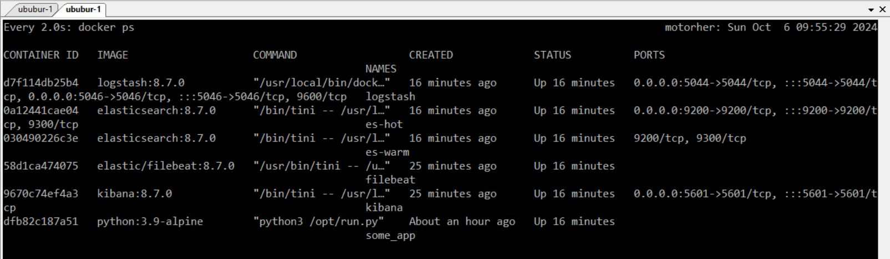

# Домашнее задание к занятию «Индексы»  «Шадрин Игорь» 


### Задание 1

Напишите запрос к учебной базе данных, который вернёт процентное отношение общего размера всех индексов к общему размеру всех таблиц.

### Решение 1 

```sql
SELECT SUM(index_length)/(SUM(data_length)/100)
FROM INFORMATION_SCHEMA.TABLES
```



### Задание 2

Выполните explain analyze следующего запроса:
```sql
select distinct concat(c.last_name, ' ', c.first_name), sum(p.amount) over (partition by c.customer_id, f.title)
from payment p, rental r, customer c, inventory i, film f
where date(p.payment_date) = '2005-07-30' and p.payment_date = r.rental_date and r.customer_id = c.customer_id and i.inventory_id = r.inventory_id
```
- перечислите узкие места;
- оптимизируйте запрос: внесите корректировки по использованию операторов, при необходимости добавьте индексы.

### Решение 2
Результат выполнения запроса:
```sql
-> Limit: 200 row(s)  (cost=0..0 rows=0) (actual time=463031..463051 rows=200 loops=1)
    -> Table scan on <temporary>  (cost=2.5..2.5 rows=0) (actual time=463031..463043 rows=200 loops=1)
        -> Temporary table with deduplication  (cost=0..0 rows=0) (actual time=463031..463031 rows=391 loops=1)
            -> Window aggregate with buffering: sum(payment.amount) OVER (PARTITION BY c.customer_id,f.title )   (actual time=393451..447239 rows=642000 loops=1)
                -> Sort: c.customer_id, f.title  (actual time=393451..408370 rows=642000 loops=1)
                    -> Stream results  (cost=22.6e+6 rows=16.5e+6) (actual time=49.6..377993 rows=642000 loops=1)
                        -> Nested loop inner join  (cost=22.6e+6 rows=16.5e+6) (actual time=49.5..348961 rows=642000 loops=1)
                            -> Nested loop inner join  (cost=20.9e+6 rows=16.5e+6) (actual time=49.1..239465 rows=642000 loops=1)
                                -> Nested loop inner join  (cost=19.3e+6 rows=16.5e+6) (actual time=48.9..129789 rows=642000 loops=1)
                                    -> Inner hash join (no condition)  (cost=1.65e+6 rows=16.5e+6) (actual time=48.7..14606 rows=634000 loops=1)
                                        -> Filter: (cast(p.payment_date as date) = '2005-07-30')  (cost=1.72 rows=16500) (actual time=1.87..716 rows=634 loops=1)
                                            -> Table scan on p  (cost=1.72 rows=16500) (actual time=0.0858..350 rows=16044 loops=1)
                                        -> Hash
                                            -> Covering index scan on f using idx_title  (cost=112 rows=1000) (actual time=0.0983..23.8 rows=1000 loops=1)
                                    -> Covering index lookup on r using rental_date (rental_date=p.payment_date)  (cost=0.969 rows=1) (actual time=0.0484..0.0734 rows=1.01 loops=634000)
                                -> Single-row index lookup on c using PRIMARY (customer_id=r.customer_id)  (cost=250e-6 rows=1) (actual time=0.0435..0.0645 rows=1 loops=642000)
                            -> Single-row covering index lookup on i using PRIMARY (inventory_id=r.inventory_id)  (cost=250e-6 rows=1) (actual time=0.0433..0.0644 rows=1 loops=642000)

```
1) Опетаторы **distinct** (удаление дубликатов) с операторами **over(partition by** (некий аналогк GROUP BY, на сколько я понял, используется для разделения строк по группам и разделам), показались очень ресурсоемкими, так же многочисленные and в операторе where не имеют смысла и добавление такого количества таблиц в оператор from не нужно, лучше использовать join. В итоге аналогичный результат был получен при выполнении следующего кода:

```sql
EXPLAIN ANALYZE                       
select concat(c.last_name, ' ', c.first_name) as CST,sum(p.amount)
FROM customer c
JOIN payment p ON p.customer_id = c.customer_id 
WHERE date(p.payment_date) = '2005-07-30'
GROUP BY c.customer_id

-> Limit: 200 row(s)  (actual time=970..983 rows=200 loops=1)
    -> Sort with duplicate removal: CST, `sum(p.amount)`  (actual time=970..975 rows=200 loops=1)
        -> Table scan on <temporary>  (actual time=935..961 rows=391 loops=1)
            -> Aggregate using temporary table  (actual time=935..935 rows=391 loops=1)
                -> Nested loop inner join  (cost=5836 rows=16500) (actual time=3.18..918 rows=634 loops=1)
                    -> Table scan on c  (cost=61.2 rows=599) (actual time=0.0872..13.3 rows=599 loops=1)
                    -> Filter: (cast(p.payment_date as date) = '2005-07-30')  (cost=6.89 rows=27.5) (actual time=0.991..1.39 rows=1.06 loops=599)
                        -> Index lookup on p using idx_fk_customer_id (customer_id=c.customer_id)  (cost=6.89 rows=27.5) (actual time=0.0775..0.684 rows=26.8 loops=599)
```
2) Поскольку тема была про индексы, добавил индексирование по дате: 
```sql
CREATE INDEX date_pay ON payment(payment_date);
```
Это ускорило выполнение скрипта

```sql
-> Limit: 200 row(s)  (cost=4164 rows=193) (actual time=5.06..460 rows=200 loops=1)
    -> Group aggregate: sum(p.amount)  (cost=4164 rows=193) (actual time=4.98..452 rows=200 loops=1)
        -> Nested loop inner join  (cost=4144 rows=193) (actual time=2.64..440 rows=313 loops=1)
            -> Index scan on c using PRIMARY  (cost=0.0228 rows=7) (actual time=0.0662..7.06 rows=284 loops=1)
            -> Filter: (cast(p.payment_date as date) = '2005-07-30')  (cost=6.89 rows=27.5) (actual time=0.974..1.41 rows=1.1 loops=284)
                -> Index lookup on p using idx_fk_customer_id (customer_id=c.customer_id)  (cost=6.89 rows=27.5) (actual time=0.0756..0.691 rows=27.1 loops=284)
```