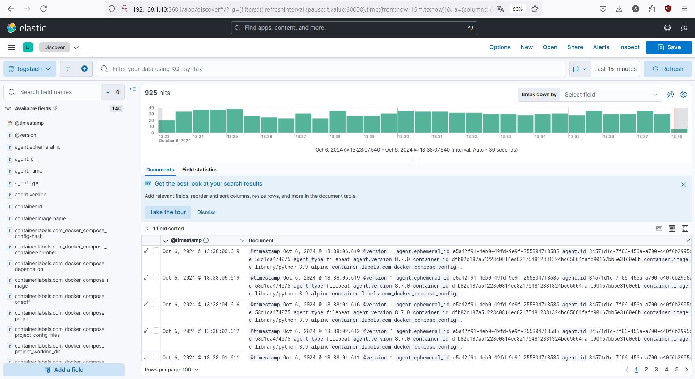
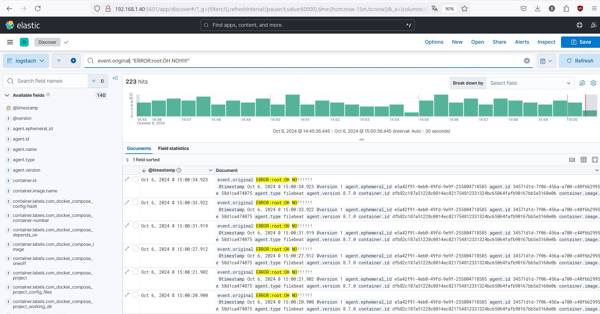

# Домашнее задание к занятию 14 «Средство визуализации Grafana» «Шадрин Игорь»


## Обязательные задания

### Задание 1

1. Используя директорию [help](./help) внутри этого домашнего задания, запустите связку prometheus-grafana.
1. Зайдите в веб-интерфейс grafana, используя авторизационные данные, указанные в манифесте docker-compose.
1. Подключите поднятый вами prometheus, как источник данных.
1. Решение домашнего задания — скриншот веб-интерфейса grafana со списком подключенных Datasource.

### Решение 1


## Задание 2

Изучите самостоятельно ресурсы:

1. [PromQL tutorial for beginners and humans](https://valyala.medium.com/promql-tutorial-for-beginners-9ab455142085).
1. [Understanding Machine CPU usage](https://www.robustperception.io/understanding-machine-cpu-usage).
1. [Introduction to PromQL, the Prometheus query language](https://grafana.com/blog/2020/02/04/introduction-to-promql-the-prometheus-query-language/).

Создайте Dashboard и в ней создайте Panels:

- утилизация CPU для nodeexporter (в процентах, 100-idle);
- CPULA 1/5/15;
- количество свободной оперативной памяти;
- количество места на файловой системе.

Для решения этого задания приведите promql-запросы для выдачи этих метрик, а также скриншот получившейся Dashboard.

## Решение 2

1. ```100 -avg(irate(node_cpu_seconds_total{job="nodeexporter", mode="idle"}[5m]))*100```



2. ```node_load1 node_load5 node_load15```



3. ```100 - 100 * (1 - ((avg_over_time(node_memory_MemFree_bytes[10m]) + avg_over_time(node_memory_Cached_bytes[10m]) + avg_over_time(node_memory_Buffers_bytes[10m])) / avg_over_time(node_memory_MemTotal_bytes[10m])))```


4. ```100 - ((node_filesystem_avail_bytes{mountpoint="/",fstype!="rootfs"} * 100) / node_filesystem_size_bytes{mountpoint="/",fstype!="rootfs"})```


## Задание 3

1. Создайте для каждой Dashboard подходящее правило alert — можно обратиться к первой лекции в блоке «Мониторинг».
1. В качестве решения задания приведите скриншот вашей итоговой Dashboard.

## Решение 3 


## Задание 4

1. Сохраните ваш Dashboard.Для этого перейдите в настройки Dashboard, выберите в боковом меню «JSON MODEL». Далее скопируйте отображаемое json-содержимое в отдельный файл и сохраните его.
1. В качестве решения задания приведите листинг этого файла.

## Решение 4

[dashboard json](dbd/dbd.json)


